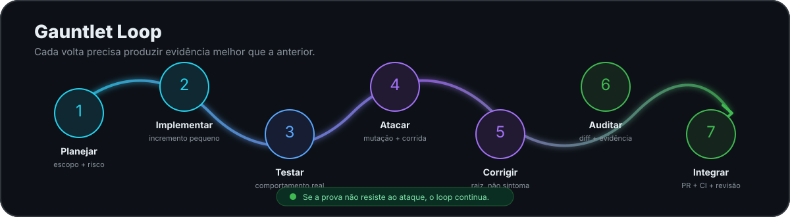

<p align="center">
  
</p>

# 📊 DataLedger

<p align="center">
  <strong>Sistema contábil brasileiro, multiempresa, auditável e preparado para evoluir por módulos.</strong>
</p>

<p align="center">
  <em>Onde devs brasileiros organizam, consultam e versionam dados como código.</em>
</p>

<p align="center">
  <a href="https://github.com/fredabsd-svg/DataLedger/actions/workflows/backend.yml"></a>
  <a href="https://github.com/fredabsd-svg/DataLedger/actions/workflows/documentation.yml"></a>
  
  
  
  <a href="https://github.com/fredabsd-svg/DataLedger/stargazers"></a>
  <a href="https://github.com/fredabsd-svg/DataLedger/forks"></a>
  <a href="https://github.com/fredabsd-svg/DataLedger/issues"></a>
  
</p>

<p align="center">
  
</p>

> **Estado atual:** a base do produto já inclui autenticação, isolamento entre escritórios, cadastro de empresas e estabelecimentos, permissões, auditoria e contabilidade básica com plano de contas, partidas dobradas, Diário, Razão e Balancete. A DL-011 acrescentou suporte ao CNPJ alfanumérico e elevou a suíte automatizada para 272 testes. Fiscal, Folha, Honorários, Processos/Paralegal, IA e MCP seguem como evolução planejada.

## ✨ O que o DataLedger quer resolver

O DataLedger nasce para reunir as rotinas de um escritório contábil em uma plataforma única, com **dados compartilhados entre módulos**, **rastreabilidade de origem**, **regras versionadas** e **isolamento entre escritórios e empresas**.

| | Capacidade | Situação |
| --- | --- | --- |
|  | **Contabilidade** — plano de contas, lançamentos por partidas dobradas, Diário, Razão e Balancete | ✅ Base implementada |
|  | **Multiempresa** — escritórios, empresas, estabelecimentos e isolamento de dados | ✅ Implementado |
|  | **Permissões e auditoria** — acesso controlado e trilha de alterações | ✅ Fundação implementada |
|  | **Fiscal** — recepção de documentos, escrituração, apuração e integração contábil | 🧭 Próximo grande fluxo |
|  | **Folha** — vínculos, eventos, férias, 13º, rescisões e encargos | 🗺️ Planejado |
|  | **Honorários e Paralegal** — contratos, cobranças, processos, prazos e documentos | 🗺️ Planejado |
|  | **IA + MCP** — consulta assistida e operações controladas pelas mesmas permissões do sistema | 🗺️ Planejado |

## 🧭 Arquitetura em uma imagem

<p align="center">
  
</p>

O núcleo atual usa **Python 3.12+, Django 6.1.1, Django REST Framework 3.18.1 e PostgreSQL**, com templates renderizados no servidor e evolução de interface apoiada por HTMX/Alpine.js. A regra central é simples: **cálculo oficial deve ser determinístico, testável e reproduzível; IA consulta, explica e propõe**.

## 🥊 Gauntlet Loop de qualidade

<p align="center">
  
</p>

A engenharia do DataLedger trata software contábil como software crítico. Uma mudança não termina quando “funciona na máquina”: ela passa por planejamento, testes, revisão do diff, auditoria, CI e registro das decisões. Na DL-011, por exemplo, sucessivas rodadas de auditoria encontraram falhas que rodadas anteriores não haviam visto — e os testes cresceram junto com as correções.

## 🧱 Princípios que não negociamos

- **Isolamento por escritório e empresa** aplicado no backend, não apenas escondido na interface.
- **Partidas dobradas** e invariantes contábeis protegidos por regra e teste.
- **Valores monetários com precisão decimal**, escala e arredondamento explícitos.
- **Rastreabilidade** de documentos, lançamentos, cálculos, atores e alterações.
- **Regras legais versionadas por vigência**, com fonte e casos de referência.
- **Idempotência** para importações, cobranças e operações sujeitas a repetição.
- **Falha visível**: erro nunca deve virar sucesso aparente.
- **IA sem acesso irrestrito ao banco** e sem substituir o motor determinístico.

## 🚀 Como rodar localmente

### 1. Clone o repositório

```bash
git clone https://github.com/fredabsd-svg/DataLedger.git
cd DataLedger
```

### 2. Crie o ambiente e instale as dependências

```bash
python -m venv .venv
# Windows: .venv\Scripts\activate
# Linux/macOS: source .venv/bin/activate
pip install -r requirements/dev.txt
```

### 3. Configure, migre e execute

```bash
cp .env.example .env
python manage.py migrate
python manage.py runserver
```

A verificação de saúde fica em `GET /api/health/`. Para entrar na aplicação, crie um usuário administrativo com `python manage.py createsuperuser` e acesse `/login/`.

### Docker Compose

```bash
cp .env.example .env
docker compose up --build
```

## 🧪 Verificações de desenvolvimento

```bash
ruff check .
ruff format --check .
pytest
python manage.py check
python manage.py makemigrations --check
```

Documentação:

```powershell
pwsh -NoProfile -File scripts/validate-docs.ps1
```

## 🛠️ Tech stack

<p>
  
  
  
  
  
  
  
  
</p>

## 🗺️ Roadmap real do repositório

- [x] **DL-001** — documentação inicial e regras de contribuição
- [x] **DL-002** — arquitetura e fundação técnica
- [x] **DL-003** — autenticação e isolamento multiempresa
- [x] **DL-004** — cadastro central de empresas e estabelecimentos
- [x] **DL-005** — permissões e auditoria
- [x] **DL-006** — contabilidade básica
- [x] **DL-007** — correções de bloqueadores da contabilidade
- [x] **DL-008** — política monetária e validação de escala
- [x] **DL-009** — fundação de interface
- [x] **DL-011** — CNPJ alfanumérico
- [ ] **DL-010** — recepção de documentos fiscais / evolução do fluxo Fiscal
- [ ] **Fiscal completo** — escrituração, apuração, obrigações e integração contábil
- [ ] **Folha de Pagamento**
- [ ] **Honorários**
- [ ] **Processos/Paralegal**
- [ ] **IA e servidor MCP**

> A ordem dos números DL reflete dependências e decisões de implementação; uma etapa posterior pode ser concluída antes de outra quando ela remove um bloqueio técnico.

## 🤝 Contribuindo

<p align="center">
  
</p>

Contribuições técnicas são bem-vindas, mas o projeto possui regras rígidas porque lida com domínio contábil e isolamento de dados. **Antes de alterar qualquer arquivo, leia integralmente [`AGENTS.md`](AGENTS.md).**

Comece por estes documentos:

- [`docs/projeto/requisitos.md`](docs/projeto/requisitos.md) — requisitos confirmados e pendências.
- [`docs/projeto/backlog.md`](docs/projeto/backlog.md) — prioridades, dependências e critérios de aceite.
- [`docs/projeto/decisoes.md`](docs/projeto/decisoes.md) — decisões arquiteturais e justificativas.
- [`docs/projeto/mapa-funcional-fiscal.md`](docs/projeto/mapa-funcional-fiscal.md) — visão funcional do domínio Fiscal.
- [`docs/planos/`](docs/planos/) — planos versionados das demandas DL.
- [`docs/auditorias/`](docs/auditorias/) — auditorias preservadas das etapas realizadas.

Fluxo esperado: **branch própria → implementação pequena → testes → revisão do diff → push → pull request → CI → revisão autorizada**.

## 📚 Navegação rápida

| Documento | Para que serve |
| --- | --- |
| [`AGENTS.md`](AGENTS.md) | Regras obrigatórias de desenvolvimento |
| [`CLAUDE.md`](CLAUDE.md) | Contexto operacional para agentes e retomada do trabalho |
| [`docs/escopo.md`](docs/escopo.md) | Escopo funcional do sistema |
| [`docs/projeto/requisitos.md`](docs/projeto/requisitos.md) | Requisitos e hipóteses |
| [`docs/projeto/backlog.md`](docs/projeto/backlog.md) | Backlog priorizado |
| [`docs/projeto/decisoes.md`](docs/projeto/decisoes.md) | Registro de decisões |
| [`docs/planos/`](docs/planos/) | Histórico das etapas DL |
| [`docs/auditorias/`](docs/auditorias/) | Relatórios de auditoria |

## 🇧🇷 Construído para a realidade contábil brasileira

O DataLedger é desenvolvido com foco em rastreabilidade, isolamento, auditabilidade e evolução segura de regras. Integrações oficiais e regras legais só devem ser tratadas como implementadas depois de validação nas fontes oficiais e evidência técnica correspondente.

<p align="center">
  <strong>Feito com engenharia, café e responsabilidade por <a href="https://github.com/fredabsd-svg">fredabsd-svg</a>.</strong>
</p>

<p align="center">
  ⭐ Se o projeto fizer sentido para você, acompanhe a evolução e deixe uma estrela.
</p>
