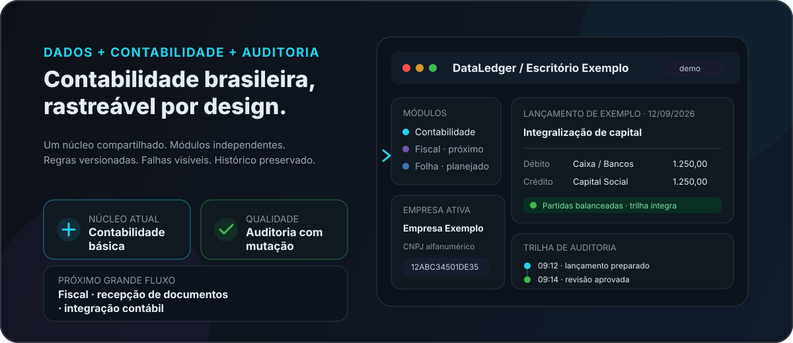
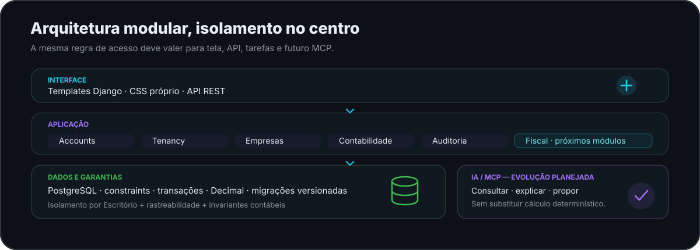
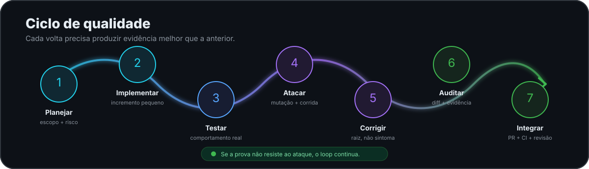
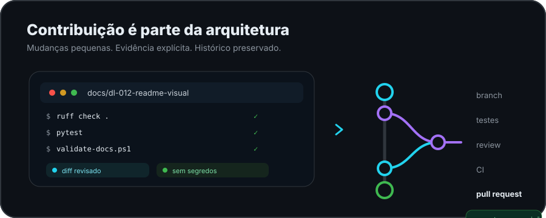

<p align="center">
  
</p>

# 📊 DataLedger

<p align="center">
  <strong>Sistema contábil brasileiro, multiempresa, auditável e preparado para evoluir por módulos.</strong>
</p>

<p align="center">
  <em>Feito para escritórios de contabilidade: cada número com origem, cada regra com vigência, cada alteração com autor.</em>
</p>

<p align="center">
  <a href="https://github.com/fredabsd-svg/DataLedger/actions/workflows/backend.yml"></a>
  <a href="https://github.com/fredabsd-svg/DataLedger/actions/workflows/documentation.yml"></a>
  
  
  
  <a href="https://github.com/fredabsd-svg/DataLedger/stargazers"></a>
  <a href="https://github.com/fredabsd-svg/DataLedger/forks"></a>
  <a href="https://github.com/fredabsd-svg/DataLedger/issues"></a>
  
</p>

<p align="center">
  
</p>

> **Onde o projeto está agora:** a fonte única do estado é [`docs/agents/estado.md`](docs/agents/estado.md) — revisão atual, etapas concluídas, próximo passo e pendências. Este README descreve o **produto e o processo**, que mudam pouco; o estado, que muda a cada etapa, mora num lugar só, de propósito. Em uma frase: a fundação (multiempresa, permissões, auditoria, contabilidade básica, política monetária, CNPJ alfanumérico) está entregue e auditada; **Fiscal, Folha, Honorários, Processos/Paralegal, IA e MCP ainda não existem**.

## ✨ O que o DataLedger quer resolver

O DataLedger nasce para reunir as rotinas de um escritório contábil em uma plataforma única, com **dados compartilhados entre módulos**, **rastreabilidade de origem**, **regras versionadas** e **isolamento entre escritórios e empresas**.

| | Capacidade | Situação |
| --- | --- | --- |
|  | **Contabilidade** — plano de contas, lançamentos por partidas dobradas, Diário, Razão e Balancete por período | ✅ Implementada. Interface no navegador: [DL-017](docs/planos/DL-017-interface-da-contabilidade.md) |
|  | **Multiempresa** — escritórios, empresas, estabelecimentos e isolamento de dados | ✅ Implementado e auditado |
|  | **Permissões e auditoria** — acesso controlado no servidor e trilha de alterações | ✅ Fundação implementada |
|  | **Fiscal** — recepção de XML, ZIP e SPED; depois escrituração, apuração e integração contábil | 🗺️ Planejado — [DL-010](docs/planos/DL-010-recepcao-de-documentos-fiscais.md) |
|  | **Folha** — vínculos, eventos, férias, 13º, rescisões e encargos | 🗺️ Planejado |
|  | **Honorários e Paralegal** — contratos, cobranças, processos, prazos e documentos | 🗺️ Planejado |
|  | **IA + MCP** — consulta assistida e operações controladas pelas mesmas permissões do sistema | 🗺️ Planejado |

A coluna acima diz se a **capacidade** existe no repositório, em traço grosso. Em que pé está cada etapa — em execução, em auditoria, reprovada, integrada — fica em [`docs/agents/estado.md`](docs/agents/estado.md), e **só lá**. Este arquivo já afirmou duas vezes coisa que o repositório desmentia; as duas por descrever estado em segundo lugar.

## 🧭 Arquitetura em uma imagem

<p align="center">
  
</p>

O núcleo usa **Python 3.12+ (a integração contínua roda em 3.14), Django 6.1.1, Django REST Framework 3.18.1 e PostgreSQL 16**, com templates renderizados no servidor e **CSS próprio, sem biblioteca visual externa** ([DE-011](docs/projeto/decisoes.md)). A regra central é simples: **cálculo oficial deve ser determinístico, testável e reproduzível; IA consulta, explica e propõe**.

## 🔁 Ciclo de qualidade

<p align="center">
  
</p>

A engenharia do DataLedger trata software contábil como software crítico. Uma mudança não termina quando "funciona na máquina": ela passa por planejamento, testes, revisão do diff, **auditoria independente com teste de mutação**, integração contínua e registro das decisões. Na DL-011, por exemplo, foram **cinco rodadas de auditoria** — a primeira reprovou, e cada rodada seguinte encontrou algo que a anterior não tinha visto. Os relatórios estão em [`docs/auditorias/`](docs/auditorias/), preservados integralmente.

## 🧱 Princípios que não negociamos

- **Isolamento por escritório e empresa** aplicado no servidor, não apenas escondido na interface.
- **Partidas dobradas** e invariantes contábeis protegidos por regra, por restrição de banco e por teste.
- **Valores monetários com precisão decimal**, escala e arredondamento explícitos — nunca ponto flutuante.
- **Rastreabilidade** de documentos, lançamentos, cálculos, atores e alterações.
- **Regras legais versionadas por vigência**, com fonte oficial e casos de referência.
- **Idempotência** para importações, cobranças e operações sujeitas a repetição.
- **Falha visível**: erro nunca vira sucesso aparente.
- **IA sem acesso irrestrito ao banco** e sem substituir o motor determinístico.

## 🚀 Como rodar localmente

### 1. Clone o repositório

```bash
git clone https://github.com/fredabsd-svg/DataLedger.git
cd DataLedger
```

### 2. Crie o ambiente e instale as dependências

Requer Python 3.12 ou superior.

```bash
python -m venv .venv
# Windows: .venv\Scripts\activate
# Linux/macOS: source .venv/bin/activate
pip install -r requirements/dev.txt
```

### 3. Configure, migre e execute

```bash
cp .env.example .env
python manage.py migrate
python manage.py runserver
```

A verificação de saúde fica em `GET /api/health/`. Para entrar na aplicação, crie um usuário administrativo com `python manage.py createsuperuser` e acesse `/login/`.

**Falta um passo, e ele hoje só existe no admin do Django.** Um usuário recém-criado não tem vínculo com nenhum escritório, então o painel responde *"Nenhum escritório ativo"* — corretamente, porque toda empresa pertence a um escritório. Em `/admin/`, crie um **Escritório** (CNPJ com 14 caracteres, só os dígitos) e, na mesma tela, um **vínculo** do seu usuário com papel **Administrador**. Depois disso o painel abre e você pode cadastrar empresas.

Que esse passo dependa de ferramenta técnica é uma lacuna conhecida, não um jeito de fazer: está registrada como **BL-125** e planejada em [DL-018](docs/planos/DL-018-primeiro-acesso.md).

Sem `DATABASE_URL` configurada e com `DEBUG=True`, o sistema usa SQLite local e avisa isso ao subir. **Com `DEBUG=False` ele exige PostgreSQL e recusa subir sem ele** — é proteção, não limitação.

### Docker Compose

```bash
cp .env.example .env
docker compose up --build
```

O `web` aplica as migrações e sobe o gunicorn em `http://localhost:8000`. Na primeira vez o PostgreSQL cria o volume do zero, e isso pode levar mais de um minuto antes de o `web` começar — é esperado.

Depois que subir, em **outro terminal**, crie o usuário para entrar:

```bash
docker compose exec web python manage.py createsuperuser
```

Então acesse `http://localhost:8000/login/` — e siga o passo do **escritório e do vínculo** descrito acima, em `http://localhost:8000/admin/`, sem o qual o painel responde "Nenhum escritório ativo".

## 🧪 Verificações de desenvolvimento

```bash
ruff check .
ruff format --check .
python manage.py check
python manage.py makemigrations --check --dry-run
pytest
```

Documentação (PowerShell 7 ou superior):

```powershell
pwsh -NoProfile -File scripts/validate-docs.ps1
```

## 🛠️ Tecnologias em uso

<p>
  
  
  
  
  
  
</p>

Só aparece aqui o que está em `requirements/` ou no repositório. Biblioteca que ainda não entrou não é anunciada.

## 🗺️ Roadmap real do repositório

A lista abaixo diz **o que existe**, nunca em que pé está. O estado de cada etapa — em execução, auditada, reprovada, integrada — vive num lugar só, [`docs/agents/estado.md`](docs/agents/estado.md). Descrever estado aqui já divergiu duas vezes; a causa é duplicação, não distração. A **sequência do que vem depois**, módulo por módulo e com critérios de conclusão, está em [`docs/projeto/plano-mestre.md`](docs/projeto/plano-mestre.md).

- [x] **DL-001** — documentação inicial e regras de contribuição
- [x] **DL-002** — arquitetura e fundação técnica
- [x] **DL-003** — autenticação e isolamento multiempresa
- [x] **DL-004** — cadastro central de empresas e estabelecimentos
- [x] **DL-005** — permissões e auditoria
- [x] **DL-006** — contabilidade básica
- [x] **DL-007** — correções de bloqueadores da contabilidade
- [x] **DL-008** — política monetária e validação de escala
- [x] **DL-009** — fundação de interface
- [x] **DL-011** — CNPJ alfanumérico (NT 2025.001 / IN RFB 2.229)
- [x] **DL-012** — redesenho do README e identidade visual
- [x] **DL-013** — logo oficial
- [x] **DL-014** — guardas de processo: regras impostas por gancho, workflow e proteção da `main`
- [x] **DL-015** — contabilidade utilizável: Diário, Razão e Balancete por período, conciliáveis entre si
- [x] **DL-017** — interface da contabilidade: plano de contas, lançamento, Diário, Razão e Balancete no navegador
- [ ] **DL-016** — competência e fechamento de período, com reabertura autorizada e auditada
- [ ] **DL-010** — recepção de documentos fiscais: XML, ZIP e SPED, em segundo plano
- [ ] **DL-018** — primeiro acesso de uma instalação nova, pelo produto e sem admin técnico
- [x] **DL-019** — portabilidade entre ferramentas de IA: os papéis da equipe em um formato só, gerados para Claude Code e Codex CLI
- [x] **DL-020** — consolidação pós-auditoria: as ressalvas da rodada 6 e as quatro regras contábeis confirmadas
- [x] **DL-021** — robustez do gerador de papéis em ambiente Windows: gravador não usa mais a camada de texto da plataforma; rede de segurança no repositório para `core.autocrlf`
- [x] **DL-022** — plano mestre de evolução por módulos e reconciliação da documentação divergente
- [ ] **DL-023** — integridade administrativa: nenhuma regra de negócio vale só na porta pela qual foi escrita
- [ ] **DL-024** — identidade visual e redesenho da interface, por gauntlet de variantes cegas com juiz mecânico
- [ ] **Fiscal completo** — escrituração, apuração, obrigações e integração contábil
- [ ] **Folha de Pagamento**
- [ ] **Honorários**
- [ ] **Processos/Paralegal**
- [ ] **IA e servidor MCP**

> A numeração DL reflete a ordem em que as demandas foram abertas, não a de conclusão: a DL-011 fechou antes da DL-010 porque removia um bloqueio dela (o CNPJ alfanumérico está em vigor desde 31/07/2026 e o sistema o recusava).

## 🤝 Contribuindo

<p align="center">
  
</p>

Contribuições técnicas são bem-vindas, mas o projeto possui regras rígidas porque lida com domínio contábil e isolamento de dados. **Antes de alterar qualquer arquivo, leia integralmente [`AGENTS.md`](AGENTS.md).**

Comece por estes documentos:

- [`docs/agents/estado.md`](docs/agents/estado.md) — **onde o projeto está** e qual é o próximo passo.
- [`docs/projeto/plano-mestre.md`](docs/projeto/plano-mestre.md) — **para onde o projeto vai**: sequência de entregas por módulo, com os critérios de conclusão. É mapa de decomposição, não fonte de estado.
- [`docs/projeto/requisitos.md`](docs/projeto/requisitos.md) — requisitos confirmados, hipóteses e pendências.
- [`docs/projeto/backlog.md`](docs/projeto/backlog.md) — prioridades, dependências e critérios de aceite.
- [`docs/projeto/decisoes.md`](docs/projeto/decisoes.md) — decisões arquiteturais e justificativas.
- [`docs/projeto/mapa-funcional-fiscal.md`](docs/projeto/mapa-funcional-fiscal.md) — visão funcional do domínio Fiscal.
- [`docs/planos/`](docs/planos/) — planos versionados das demandas DL.
- [`docs/auditorias/`](docs/auditorias/) — auditorias preservadas das etapas realizadas.

Fluxo esperado: **branch própria → implementação pequena → testes → revisão do diff → push → pull request → CI → revisão autorizada**.

## 📚 Navegação rápida

| Documento | Para que serve |
| --- | --- |
| [`AGENTS.md`](AGENTS.md) | Regras obrigatórias de desenvolvimento |
| [`CLAUDE.md`](CLAUDE.md) | Resumo operacional para agentes de IA |
| [`docs/agents/equipe.md`](docs/agents/equipe.md) | Papéis da equipe de agentes, em todas as ferramentas suportadas |
| [`docs/agents/estado.md`](docs/agents/estado.md) | Estado atual e retomada do trabalho — fonte única |
| [`docs/escopo.md`](docs/escopo.md) | Escopo funcional do sistema |
| [`docs/projeto/plano-mestre.md`](docs/projeto/plano-mestre.md) | Sequência de evolução por módulo e critérios de conclusão |
| [`docs/projeto/requisitos.md`](docs/projeto/requisitos.md) | Requisitos e hipóteses |
| [`docs/projeto/backlog.md`](docs/projeto/backlog.md) | Backlog priorizado |
| [`docs/projeto/decisoes.md`](docs/projeto/decisoes.md) | Registro de decisões |
| [`docs/planos/`](docs/planos/) | Histórico das etapas DL |
| [`docs/auditorias/`](docs/auditorias/) | Relatórios de auditoria |

## 🇧🇷 Construído para a realidade contábil brasileira

O DataLedger é desenvolvido com foco em rastreabilidade, isolamento, auditabilidade e evolução segura de regras. Integrações oficiais e regras legais só são tratadas como implementadas depois de validação nas fontes oficiais, evidência técnica correspondente e **validação profissional do responsável técnico** — auditoria de software não substitui a do contador.

<p align="center">
  <strong>Feito com engenharia, café e responsabilidade por <a href="https://github.com/fredabsd-svg">fredabsd-svg</a>.</strong>
</p>

<p align="center">
  ⭐ Se o projeto fizer sentido para você, acompanhe a evolução e deixe uma estrela.
</p>
