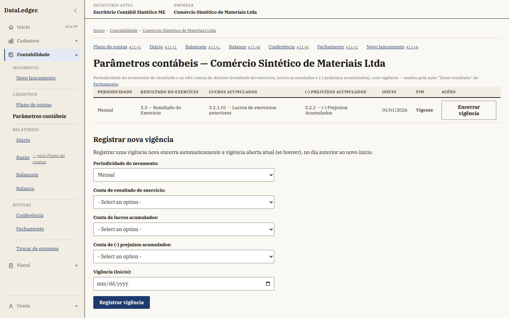
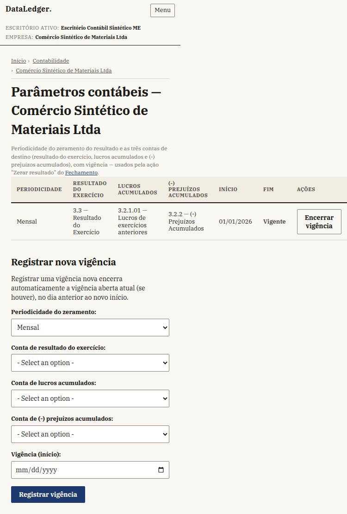
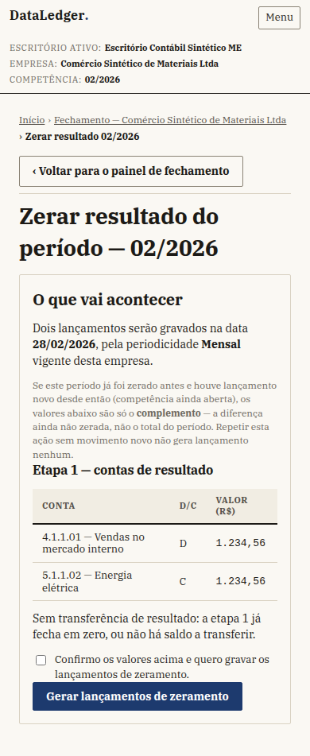
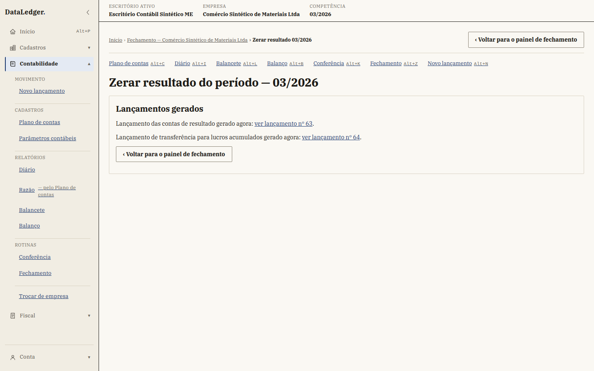
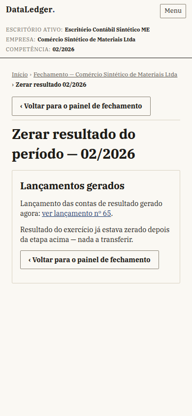
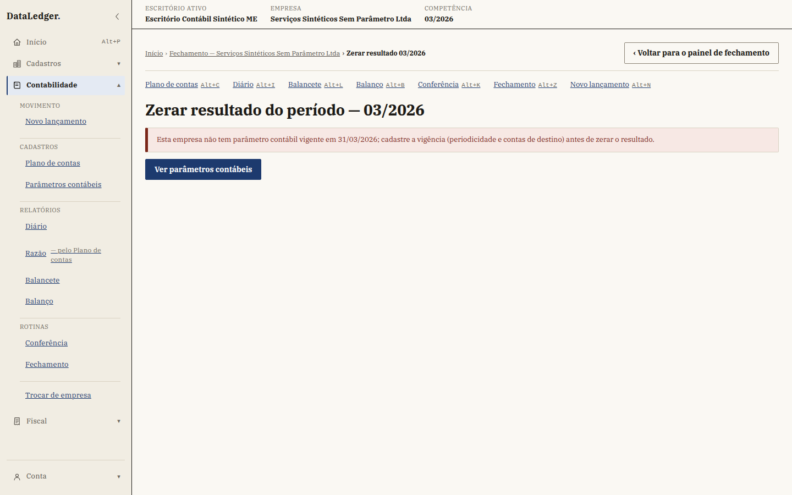
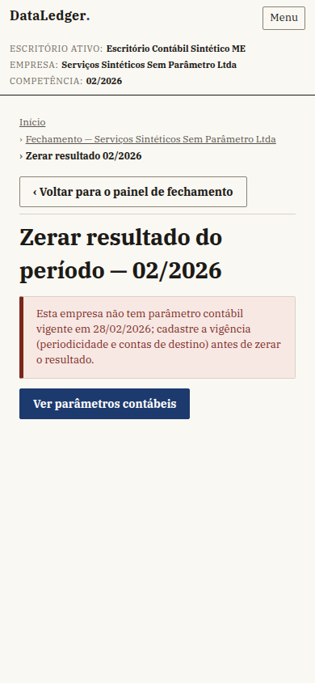

# DL-043 fatia 3 — telas de parâmetro contábil e zeramento do resultado

Capturas para o Fred conferir as telas novas da DL-043 antes da integração.
Dados 100% sintéticos: escritório, empresa e plano de contas de
`scripts/semear_base_de_medicao.py` (73 contas, 60 lançamentos em 03/2026),
acrescidos de três contas de destino do zeramento e um movimento pequeno em
02/2026 — ambos por um script de apoio local, não versionado, no mesmo
espírito de `apps/fiscal/tests/xml_sinteticos.py` para o Fiscal. Uma segunda
empresa sintética, sem parâmetro contábil registrado, sustenta a captura do
estado "sem parâmetro vigente". Chromium, 26/09/2026. Não são telas "antes/
depois": são telas NOVAS (fatia 3 não existia antes desta etapa) — o
servidor (fatias 1 e 2) já estava integrado.

## Parâmetros contábeis

Arquétipos A (tabela) + B (formulário) combinados numa só tela, no molde de
`fechamento.html`: lista de vigências (periodicidade, as três contas de
destino, início/fim, vigente/encerrada) e formulário de nova vigência logo
abaixo — sempre visível para quem lê a contabilidade; o formulário e o botão
"Encerrar vigência" só aparecem para ADMINISTRADOR/GESTOR (RC-102 por
analogia com o fechamento de competência).

Computador (1440 × 900):

Celular (390 × 844):

## Zerar resultado — prévia (arquétipo E, primeira etapa)

GET com a competência escolhida no painel de Fechamento: mostra os itens
calculados (conta, D/C, valor em R$ pt-BR) das duas etapas do zeramento
(RC-104) — nunca grava nada. A nota permanente sobre "complemento" cobre o
caso de repetição com movimento novo (ver "Decisões" no retorno desta
etapa: o serviço não expõe se uma dada prévia é a primeira vez ou um
complemento, então a explicação é sempre visível, não condicional).

Computador — competência 03/2026, com as duas etapas (lucro do período):

Celular — competência 02/2026 (movimento sintético menor, resultado
exatamente zero: mostra o estado "sem transferência de resultado" da etapa
2, um caso de referência do próprio critério de aceite do plano):

## Zerar resultado — resultado (depois da confirmação)

POST com a caixa de confirmação marcada: grava os lançamentos (dentro da
trava de competência do serviço) e mostra o que foi gerado, com link para
cada lançamento no Diário/Razão.

Computador:

Celular:

## Zerar resultado — estado "sem parâmetro contábil vigente"

Empresa sem nenhuma vigência registrada: a mensagem vem do próprio serviço
(`ParametroContabilInvalido`), e a tela oferece o link direto para cadastrar
o parâmetro — nenhum botão de confirmação aparece (nada para gravar).

Computador:

Celular:

## Estados não capturados em imagem (cobertos por teste automatizado)

- **Competência fora da periodicidade vigente** (ex.: parâmetro trimestral,
  pedido de fevereiro) — mesmo layout do estado "sem parâmetro", mensagem
  do serviço diferente. `test_previa_fora_da_periodicidade_mostra_mensagem_
  do_servico`.
- **Competência encerrada (RC-57)** — mesmo layout, sem o botão de
  confirmação. `test_previa_competencia_encerrada_recusa_sem_oferecer_o_
  botao`.
- **Sem permissão (403)** — template padrão `erros/sem_permissao.html`,
  igual ao resto do produto; não é uma tela NOVA desta etapa.
  `test_analista_le_previa_mas_nao_confirma`,
  `test_cliente_nao_le_a_lista`.
- **Empresa de outro escritório (404)** — resposta padrão do Django, sem
  template próprio. `test_isolamento_zerar_empresa_de_outro_escritorio_e_
  404`, `test_isolamento_parametros_empresa_de_outro_escritorio_e_404`.
- **Idempotência pela tela** (repetir a confirmação sem movimento novo) —
  `test_repeticao_pela_tela_e_idempotente`.

Todos os testes acima estão em
`apps/contabilidade/tests/test_dl043_fatia3_telas.py`.
