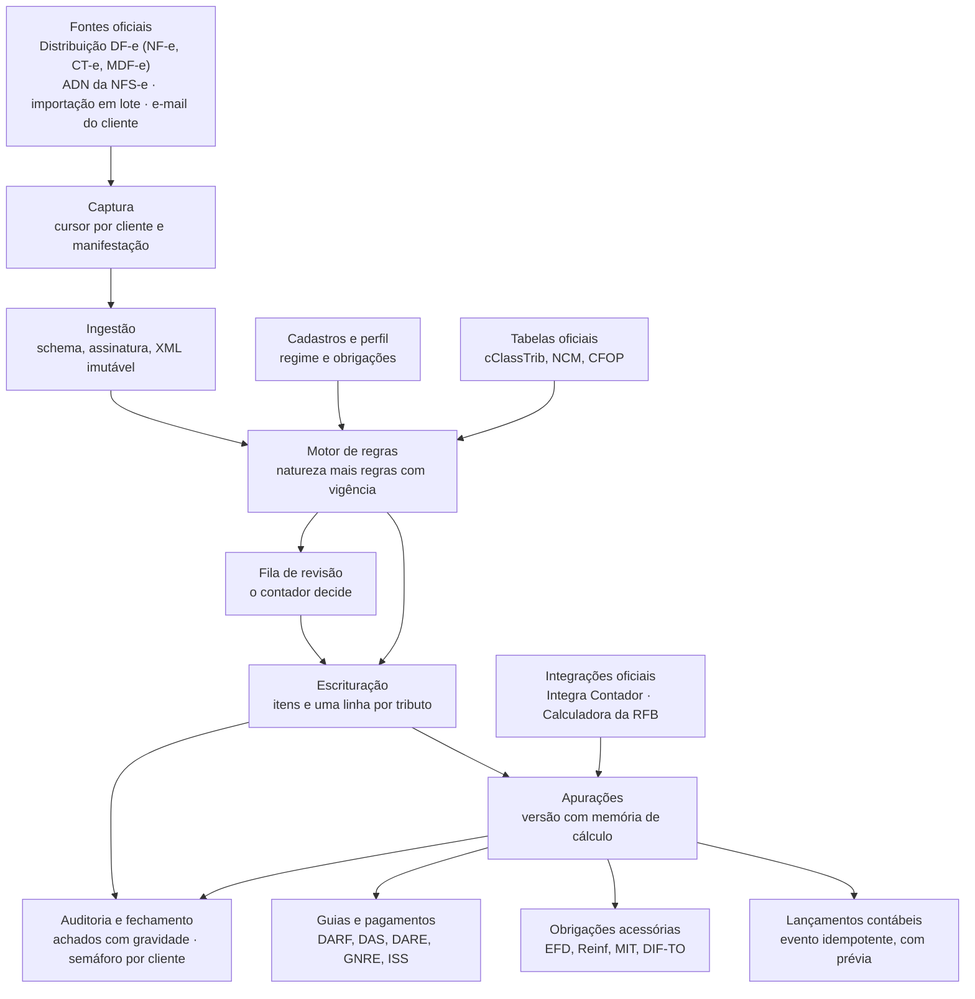

# DL-067 — Plano do módulo fiscal: roteiro de out/2026 a 2028, com a reforma tributária

**Demanda:** ordem direta do Fred em 05/10/2026 — analisar o módulo fiscal com
cuidado, tratar os manuais do sistema de referência só como exemplo, pesquisar
na internet as novidades, as obrigações acessórias novas e a legislação, e
montar o plano. Recebido por ele no mesmo dia com "Ótimo" e a ordem de subi-lo
para o GitHub. **Estado:** [fonte única](../agents/estado.md).
**Branch:** `docs/dl-067-plano-do-modulo-fiscal` → `main`. **Risco:** esta
etapa é **só documentação** — nenhum código, dado, contrato ou migração. Cada
fatia de código que sair daqui terá **DL própria** e o nível do
[AGENTS.md §3.1](../../AGENTS.md): apuração, guia e arquivo de obrigação são
**nível 1** (cálculo monetário e documento entregue); importador, tela e
relatório de conferência são **nível 2**.

## Decisões do Fred que valem aqui

| Origem | Decisão |
| --- | --- |
| **05/10/2026** | O plano nasce de pesquisa normativa atual, não da cópia do sistema de referência: os manuais "são apenas exemplos". |
| **05/10/2026** | "Ótimo, suba o plano para o GitHub" — o plano vira este documento. Onde ele contradiz RC ou DE já registrado, **vale o registrado até o Fred decidir**: a regra 2 do §0 do [AGENTS.md](../../AGENTS.md) faz a ordem dele prevalecer sobre decisão anterior, mas o "Ótimo" foi dado a um plano que não conhecia essas decisões. A lista está em [Divergências que só o Fred decide](#divergências-que-só-o-fred-decide). |
| RC-40, RC-41 (12/09/2026) | A rotina mais cara é **importar e conferir**; o escritório importa de um **sistema de gestão de XML de terceiros**, não da SEFAZ. |
| RC-42 (12/09/2026) | A carteira tem segmentos especializados (combustíveis, empreendimentos imobiliários, transporte); o fiscal não pode supor só comércio e serviço. |
| RC-57, RC-101, RC-102, RC-103 | Nada se grava dentro de período fechado; antes da entrega reabre, depois da entrega o ajuste vai no mês aberto; o estorno de lançamento de mês fechado nasce com a data de hoje e cai em mês aberto; só ADMINISTRADOR ou GESTOR fecha e reabre. |
| RC-87, RC-88 | A ordem de execução aprovada intercala a Contabilidade com a recepção de NFS-e; a contabilização automática só é liberada depois de fechamento, origem, efetivação e contrato de integração. A hipótese HI-01 (Contabilidade antes de Fiscal e Folha) ainda espera confirmação. |

## Relação com o que o repositório já tem

O plano foi escrito **antes** de ler o repositório: o computador do Fred não
estava conectado na sessão da pesquisa. Ao versioná-lo, ele foi conferido
contra o código e contra [paridade/fiscal.md](../projeto/paridade/fiscal.md),
[mapa-funcional-fiscal.md](../projeto/mapa-funcional-fiscal.md),
[requisitos.md](../projeto/requisitos.md), [decisoes.md](../projeto/decisoes.md)
e [backlog.md](../projeto/backlog.md). A conferência foi feita por um agente de
leitura, e cada afirmação abaixo aponta o requisito, a decisão ou o arquivo.

**Conclusão: este plano complementa a paridade; não a substitui.**

- [paridade/fiscal.md](../projeto/paridade/fiscal.md) (DL-047, 27/09/2026) diz
  **o quê**: 91 itens FIS com critério de aceite, em ordem de dependência, sem
  datas, com o que fica fora (FIS-80 a FIS-97).
- Este plano diz **quando** e **o que mudou** em 2026 e 2027: CBS e IBS em
  teste, apuração assistida da CBS, Simples Nacional em 2027, LC 224/2025,
  Lei 15.270/2025, MIT, leiaute 021 da EFD ICMS/IPI e o fim da
  EFD-Contribuições. Medido por busca: a LC 224 não aparece em
  `paridade/fiscal.md`, e CBS/IBS aparecem só como aviso e numa menção do
  FIS-27.
- Item vira código só com **plano DL próprio** — regra da paridade e do
  [AGENTS.md](../../AGENTS.md) §3.

### O que já existe e não se refaz

| O plano pede | O repositório já tem | Onde |
| --- | --- | --- |
| CNPJ alfanumérico (decisão 9, MF-CAD-01) | Validador do dígito verificador alfanumérico | [DL-011](DL-011-cnpj-alfanumerico.md), `apps/empresas/validators.py` |
| XML guardado sem reformatar, com hash e sem duplicidade (MF-CAP-03) | Para a NFS-e nacional: XML byte a byte com SHA-256 no PostgreSQL, deduplicação por escritório, leitura com `defusedxml` | DE-074, `apps/fiscal/models.py` |
| Leitura da NFS-e nacional e estado por eventos (MF-ISS-01, MF-ISS-02, parte do MF-CAP-10) | Recepção dos leiautes 1.00 e 1.01; os quatro eventos que cancelam | [DL-010 F1](DL-010-F1-recepcao-nfse.md), RC-111, HI-20 |
| Importação em lote (parte do MF-CAP-02) | XML e ZIP, até 2.000 arquivos, um envio por vez por escritório | DE-076, HI-22 |
| Grupo IBS/CBS da NFS-e (MF-CAP-05, MF-ISS-09) | Guardado inteiro no XML, **não interpretado** | DE-074, PE-39 |
| Período com estados (MF-WF-01) | `Competencia` aberta ou encerrada, reabertura com motivo, "entregue" como fato datado | DL-016, RC-101, RC-102 |
| Trilha, isolamento e papéis (MF-SEG-01, MF-SEG-02, MF-SEG-05) | Trilha na mesma transação e imutável; escritórios isolados; seis papéis | DL-024, DE-014, `apps/tenancy/models.py` |
| Regime tributário com vigência (parte do MF-CAD-05) | `HistoricoRegimeTributario`, com três regimes | `apps/empresas/models.py` |
| Decimal exato e arredondamento por regra (MF-CAD-15) | Decidido | DE-010 |
| Fila em segundo plano (Arquitetura técnica) | **Decidida, não implementada:** `django.tasks` com `django-tasks-db` | DE-015, BL-52 |

O que **não** existe, medido: inscrição estadual, inscrição municipal, CNAE e
município IBGE no cadastro; origem e documento de origem no lançamento contábil
(**BL-72**, pré-requisito de toda integração fiscal → contábil); cofre de
certificados; MFA; API do app fiscal; qualquer dependência fiscal além de
`defusedxml`.

### O que foi corrigido no corpo do plano

Pontos em que o plano contradizia decisão já registrada e o repositório
prevalece. As passagens corrigidas trazem a marca **[conciliação]**.

| # | O plano dizia | O repositório diz | Como ficou |
| --- | --- | --- | --- |
| 1 | Período com estados aberto, em revisão, fechado e transmitido | Competência aberta ou encerrada; "entregue" é fato datado; depois da entrega não reabre (RC-101); só ADMINISTRADOR ou GESTOR fecha (RC-102) | O fiscal usa a `Competencia` que existe; "em revisão" é estado da **apuração**; "transmitida" é fato datado **novo**, por obrigação e com recibo |
| 2 | Correção em período fechado "vira estorno, não exclusão" | Certo, com uma condição: nada se grava dentro do mês fechado (RC-57), então o estorno nasce com a data de hoje e cai em mês aberto — quem decide é a competência do estorno (RC-103); antes da entrega, também se pode reabrir (RC-101) | Precisado no corpo |
| 3 | Papéis preparador, revisor, aprovador e transmissor | Seis papéis; matriz fiscal ainda não definida (HI-21, PE-08) | Viram **permissões por operação** sobre os seis papéis; MFA é novo |
| 4 | Ciência da manifestação "automática por cliente" | Transmissão oficial exige aprovação explícita, vinculada à operação e aos dados ([AGENTS.md](../../AGENTS.md) §11) | Ciência por ação aprovada |
| 5 | Python com SQLAlchemy, XML como objeto comprimido, RLS | Django 6.1 e DRF (RC-30), PostgreSQL 16 obrigatório (RC-31, BL-50), XML no banco (DE-074), isolamento no software (DE-014) | Corrigido; `nfelib`, `lxml`, `signxml`, `cryptography`, cofre com KMS e RLS ficam como **propostas que exigem DE nova** |
| 6 | Pergunta "uso só interno ou produto para outros escritórios?" | Decidido: produto com escritórios isolados (DE-014, DL-036) | Pergunta removida; MF-SEG-05 deixa de ser condicional |
| 7 | Pergunta "confirmar a stack" | Respondida pelo próprio repositório | Removida |
| 8 | DASN listada como caduca e DASN-SIMEI mantida | Inconsistência interna do plano | Caduca é a DASN do Simples, substituída pela DEFIS; a DASN-SIMEI do MEI continua |
| 9 | Carteira descrita com cliente identificável | O repositório é **público**; dado real de cliente não entra ([CLAUDE.md](../../CLAUDE.md)) | Descrição genérica |

### Divergências que só o Fred decide

Aqui o plano traz fato novo, mas a decisão registrada é dele. **Vale o que está
registrado até ele mudar.**

1. **Ordem de prioridade.** O plano começa o fiscal já e quer a conferência da
   CBS pronta em fevereiro de 2027. A ordem aprovada é outra: Contabilidade
   intercalada com a recepção de NFS-e (RC-87, RC-88); a hipótese HI-01, ainda
   não confirmada, põe a Contabilidade antes de Fiscal e Folha; e a
   [DL-047](DL-047-mapa-de-paridade-funcional.md) recomenda fechar a
   contabilidade anual primeiro. O fato novo a pesar: a RFB
   apresenta a primeira apuração assistida da CBS até 15/02/2027, com ajustes
   até 26/02/2027 (Decreto 12.955/2026, art. 46).
2. **Captura automática ou sistema de gestão de XML.** O plano chama a captura
   pelos canais oficiais (Distribuição DF-e, ADN) de "funcionalidade de maior
   valor"; ela exige o certificado A1 de cada cliente guardado no sistema. O
   escritório hoje importa de um sistema de terceiros (RC-41). Neste
   documento, a importação em lote vem primeiro (já era a Onda 0) e a captura
   automática fica **condicionada** à decisão do Fred.
3. **Premissa da carteira.** O plano não previa os segmentos do RC-42, e o
   acervo tem NFS-e de **52 municípios** (RC-76), não só de Palmas. A premissa
   foi corrigida; as regras de ISS por município (MF-ISS-03) precisam escalar
   além de Palmas, e os segmentos especializados seguem como referência, não
   implementação, no primeiro corte (FIS-43).
4. **Lucro Real, Lalur e ECF.** A paridade deixa o Real fora do fiscal porque
   "não há evidência de cliente nesse regime", põe a ECF no CTB-52 e o Lalur em LAL-01 a
   LAL-26; o [escopo](../escopo.md) prevê o Real em incrementos validados. O
   plano punha Real e ECF na Onda 3 do fiscal. Neste documento eles apontam
   para CTB-52 e LAL; trazê-los para o fiscal é mudança de escopo.
5. **EFD-Contribuições.** A paridade planeja a EFD-Contribuições inteira, dos
   parâmetros (FIS-29) à geração do arquivo (FIS-34), no primeiro regime ponta
   a ponta. O plano não constrói gerador, porque
   a NT RFB 11/2026 encerra a EFD-Contribuições para fatos geradores a partir
   de janeiro de 2027. ⚠️ **O texto oficial da NT não foi lido** — a fonte é
   secundária (escritório de advocacia e Senior). Proposta: emendar FIS-29 a
   FIS-34 em demanda própria, depois de ler a NT no portal do SPED.
6. **Obrigações caducas.** O plano tira Redução Z, DCTF mensal e DeSTDA no TO;
   a paridade mantém FIS-40, FIS-67 e FIS-68 em escopo ou "a confirmar".
   Conferir em fonte oficial antes de emendar.
7. **Carga inicial e comparação com o sistema de referência.** Adotar formato
   de intercâmbio de terceiros é decisão de produto com dimensão jurídica
   (PE-18), e o [escopo](../escopo.md) manda não presumir API pública. Neste
   documento, carga e comparação usam só leiautes públicos (SPED, EFD, XML
   oficial) até a PE-18 ser decidida.

### Vocabulário deste documento

- **IDs com prefixo `MF-`** (módulo fiscal): `CTB-`, `PAT-` e `HON-` já
  nomeiam outras coisas nos mapas de [paridade](../projeto/paridade/README.md).
  Os 152 requisitos do plano foram renomeados (`CAD-01` → `MF-CAD-01`).
- **"Onda" aqui é janela de datas** (Onda 0 = out–dez/2026 … Onda 4 = 2028 em
  diante). Na paridade, "onda" é **ordem de dependência**, de 0 a 12. Não são
  a mesma coisa.
- **Prioridade alta, média e baixa** não é a escala P0/P1/P2 do backlog.
- **Confiança dos fatos:** o que a pesquisa marcou como "confirmado" é regra
  confirmada; "fonte secundária" é **hipótese**; "não confirmado" é
  **pendência**. Hipótese e pendência não viram regra ativa — o plano já
  dizia isso ("entra desativado até alguém conferir na fonte").

### Requisitos do repositório que o plano não tinha

- **RC-43 e RC-44:** receber RAR e importar notas em formato SPED Fiscal —
  acrescentados como MF-CAP-13 e MF-CAP-14.
- **RC-94:** a personalização de relatório vale para todos os módulos — os
  livros e relatórios do fiscal seguem as três classes de documento de
  [personalizacao-de-relatorio.md](../projeto/personalizacao-de-relatorio.md).
- **RC-60, BL-74, BL-66 e BL-72:** a classificação da operação decide o
  tratamento fiscal e a contabilização; as "quatro peças" do motor de regras
  são o desenho dessa classificação, e a integração contábil depende da origem
  no lançamento (BL-72) e da regeração controlada (BL-66).
- **RC-110:** o significado de `tpRetISSQN` já está confirmado em fonte
  oficial; o ISS retido (MF-ISS-05) parte dele.

## Esta etapa (DL-067)

| Item | Conteúdo |
| --- | --- |
| Objetivo e escopo | Versionar o plano do módulo fiscal e a conciliação com o repositório. Nada de código. |
| Entregáveis | Este arquivo; a linha da DL-067 em [estado.md](../agents/estado.md) e no README. |
| Dependências | Nenhuma de código. A DL-066 (#86) foi integrada durante esta etapa e mexia nas mesmas linhas do `estado.md` e do README: o conflito foi resolvido mantendo as duas etapas. O PR da DL-064 (#83) toca o mesmo `estado.md`. |
| Critérios de aceite | (1) `scripts/validate-docs.ps1` sem problema; (2) `apps/core/tests/test_documentacao_do_estado.py` passa; (3) nenhum dado identificável de cliente; (4) toda divergência com RC ou DE está declarada acima, sem decisão do Fred inventada. |
| Testes | Documentais: os dois de cima. Sucesso, erro e limite de regra fiscal não se aplicam — não há regra implementada. |
| Impacto | Nenhum em segurança, dados, cálculo, contrato ou desempenho. |
| Reversão | Apagar este arquivo e as duas linhas. |

**Primeira fatia candidata, se o Fred aprovar a direção:** o validador de
conformidade IBS/CBS (MF-RT-02) sobre as NFS-e **que o sistema já recebe**. O
XML está guardado inteiro (DE-074), então a fatia interpreta um bloco que já
chegou, sem captura nova, sem cofre e sem dependência nova. Ela responde a
PE-39 e entrega o relatório que o plano marca como essencial até 31/12/2026.
Antes, ela precisa dos importadores das tabelas oficiais de classificação
(MF-CAD-10) e de uma DL de nível 2.

---

## Plano

Versão entregue ao Fred em 05/10/2026, com as correções da conciliação
marcadas **[conciliação]**.

O módulo fiscal do DataLedger deve nascer como um motor de escrituração alimentado pelos XMLs oficiais e por regras com vigência, não como cópia das telas do Domínio. A construção vai em ondas com critério de passagem: a Onda 0, até 31/12/2026, entrega importação de XML, validação do IBS/CBS e calendário; a Onda 1, de janeiro a março de 2027, entrega escrituração e apurações (Simples, ISS, Presumido com a LC 224), com a conferência da CBS pronta em fevereiro. O PIS/Cofins fica congelado na competência 12/2026, porque a CBS assume em 2027.

### Decisões-chave

São onze decisões de projeto. Todas as seções seguintes derivam delas.

1. **O documento eletrônico é a fonte.** A escrituração nasce do XML (NF-e, NFC-e, CT-e, NFS-e) capturado ou importado. Digitação manual é exceção registrada, e nenhum valor é estimado.
2. **Vigência em tudo.** Alíquota, regra, tabela, prazo, código de receita e leiaute têm início, fim e fonte legal. Nenhuma constante fiscal fica no código.
3. **Tributo é dado, não coluna.** Um catálogo extensível guarda ICMS, IPI, PIS, Cofins, ISS, CBS, IBS-UF, IBS-Município, IS, IRRF, CSRF e INSS retido. Cada item de documento tem uma linha por tributo.
4. **O acumulador do Domínio vira quatro peças:** natureza da operação, regras tributárias declarativas, modelo contábil por papéis de conta e mapa para as obrigações. O contador continua escolhendo só a natureza.
5. **Cálculo determinístico; IA na autoria e na auditoria.** A IA sugere natureza e regra e aponta anomalias. Ela não calcula imposto, não concilia e não decide.
6. **Apuração versionada sobre a competência que já existe.** **[conciliação]** A competência segue o repositório — aberta ou encerrada, com "entregue" como fato datado (RC-101, RC-102). O fiscal acrescenta a apuração **em revisão** e o fato datado **transmitida**, por obrigação e com recibo. Recálculo nunca é silencioso, e retificação fica rastreada.
7. **Integração contábil nativa.** Fiscal e contábil dividem o banco. Cada documento, apuração, guia e pagamento gera um evento contábil idempotente, com histórico padronizado.
8. **PIS/Cofins só até 12/2026.** As competências que restam seguem no Domínio; o DataLedger importa as EFD-Contribuições entregues, para guardar saldos e auditar, sem gerador novo. A base de itens, CST e naturezas é reaproveitada na CBS. **[conciliação]** Diverge da EFD-Contribuições prevista em FIS-29 a FIS-34 da paridade; ver [Divergências](#divergências-que-só-o-fred-decide), item 5.
9. **CNPJ alfanumérico em todo o módulo.** CNPJ e chaves são texto de 14 e 44 posições, com dígito verificador sobre o valor ASCII menos 48. **[conciliação]** O cadastro já aceita desde a [DL-011](DL-011-cnpj-alfanumerico.md); o fiscal herda o validador.
10. **Escriturar, não emitir, no MVP.** O DataLedger captura, escritura, apura e confere. Emitir NF-e ou NFS-e fica para depois, por provedor ou biblioteca pronta.
11. **O Domínio segue como sistema oficial** até cada obrigação passar no teste de execução em paralelo (seção Migração).

### Calendário regulatório

Três prazos vencem antes de qualquer entrega do sistema: 15/10 e 30/10/2026 (opções do Simples para 2027, canceláveis de 03/11 a 20/12/2026) e 01/11/2026 (NFS-e pelo Emissor Nacional para ME/EPP). Eles se resolvem fora do DataLedger, por planilha e decisão com cada cliente. O plano se encaixa nos marcos seguintes.

| Data | Marco |
| --- | --- |
| 05/10/2026 | NF-e: regras de IBS/CBS revisadas |
| 15/10/2026 | Fim da opção pelo Simples para 2027 |
| 30/10/2026 | Fim da opção pelo regime regular de IBS/CBS |
| 01/11/2026 | ME e EPP no Emissor Nacional da NFS-e |
| 03/11 a 20/12/2026 | Cancelamento das opções de 2027 |
| 01/12/2026 | NFS-e: IBS/CBS em TI, locações e plataformas |
| 31/12/2026 | Fim da tolerância da NFS-e e do Programa Nacional de Conformidade |
| **01/01/2027** | **CBS plena; fim do PIS/Cofins** |
| 15/02/2027 | 1ª apuração assistida da CBS (prevista) |
| 16/02/2027 | Última EFD-Contribuições (competência 12/2026) |
| 01 a 31/03/2027 | 2ª janela do regime regular no Simples |

A data em destaque muda a apuração de todos os clientes do regime regular. A primeira apuração assistida da CBS sai até 15/02/2027, com ajustes até 26/02/2027 (Decreto 12.955/2026, art. 46); o início do uso obrigatório em 2027 vem de fontes secundárias.

**Transição 2026–2033** (LC 214/2025, arts. 343 a 348; EC 132/2023, ADCT)

| Ano | CBS | IBS | PIS/Cofins | ICMS e ISS | O que muda no sistema |
| --- | --- | --- | --- | --- | --- |
| 2026 | 0,9% de teste, compensável com PIS/Cofins | 0,1% de teste | integrais | integrais | Ler e validar o grupo IBS/CBS; o recolhimento é dispensado a quem cumpre as obrigações acessórias (art. 348) |
| 2027 e 2028 | alíquota de referência menos 0,1 p.p. (o Senado ainda não fixou) | 0,05% UF + 0,05% município | extintos | integrais | CBS plena com apuração assistida; IPI zerado, salvo ZFM; Imposto Seletivo depende de lei |
| 2029 | plena | 10% da alíquota | — | 90% | Fatores de transição entram como parâmetros com vigência |
| 2030 | plena | 20% | — | 80% | idem |
| 2031 | plena | 30% | — | 70% | idem |
| 2032 | plena | 40% | — | 60% | idem |
| 2033 | plena | 100% | — | extintos | Saldo credor de ICMS homologado e usado em 240 parcelas (LC 227/2026) |

Na folha, a desoneração recua no mesmo período (Lei 14.973/2024): a CPRB vale 60% da alíquota em 2026 e 40% em 2027, com a contribuição sobre a folha em 50% e 75%, e acaba em 2028. A base de IBS/CBS exclui ICMS, ISS, PIS e Cofins de 2026 a 2032 (LC 214, art. 12, § 2º).

### Escopo e premissas

O módulo cobre a escrita fiscal completa de clientes do Simples, MEI, Presumido e Real, com base no Tocantins e filiais em outras UFs. Emissão de documentos, folha e ECD ficam fora; o fiscal só troca dados com eles. **[conciliação]** Na paridade, o Lucro Real, o Lalur e a ECF estão em LAL-01 a LAL-26 e no CTB-52; ver [Divergências](#divergências-que-só-o-fred-decide), item 4.

| Área | Dentro do módulo fiscal | Fora, ou só interface |
| --- | --- | --- |
| Documentos | Captura e ingestão de NF-e, NFC-e, CT-e, MDF-e e NFS-e; eventos; manifestação | Emissão de NF-e e NFS-e (fase futura) |
| Escrituração e regras | Cadastros, perfil fiscal, motor de regras, entradas, saídas, serviços | Contas a pagar e receber (ficam no ERP do cliente; parcelas só quando o regime é de caixa) |
| Apurações | ICMS (próprio, ST, DIFAL, FECOEP), IPI básico, ISS, Simples, IRPJ/CSLL, PIS/Cofins até 12/2026, CBS/IBS, retenções, dividendos | Encargos da folha e CPRB (módulo Folha; o fiscal recebe a folha de 12 meses para o fator R) |
| Obrigações | EFD ICMS/IPI, EFD-Contribuições, EFD-Reinf, preparação da MIT/DCTFWeb, DIF-TO, conferência do PGDAS-D | ECD (contábil, CTB-51; o SPED Hub já cobre); ECF entra na Onda 3 junto com o contábil (CTB-52) |
| Módulos vizinhos | CIAP e créditos sobre o ativo (troca com o Patrimônio) | Patrimônio e Honorários como módulos próprios |

**Premissas**

- **[conciliação]** Carteira, descrita sem identificar cliente porque o repositório é público: Simples de serviços e comércio, Presumido, empresas com filiais em outras UFs, MEI, e os segmentos especializados do RC-42 (combustíveis, empreendimentos imobiliários, transporte).
- Sede do escritório no Tocantins; o ISS da maioria dos clientes é de Palmas, que emite pelo WebISS e compartilha as notas com o ambiente nacional desde 01/2026; ME e EPP do Simples passam ao Emissor Nacional em 01/11/2026. **[conciliação]** O acervo do escritório tem NFS-e de 52 municípios (RC-76), então as regras por município não podem parar em Palmas.
- **[conciliação]** Stack verificada no repositório: Django 6.1 com DRF (RC-30), PostgreSQL 16 (RC-31) e Python 3.14 na integração contínua. O app `apps/fiscal` já recebe NFS-e nacional (DL-010 fatia 1). A seção Arquitetura técnica foi ajustada a isso.
- Legislação conferida até 05/10/2026. Cada fato vem marcado na pesquisa como confirmado, fonte secundária ou não confirmado; os não confirmados estão em [Pendências e fontes](#pendências-e-fontes).

**Como os manuais do Domínio entraram.** Os quatro arquivos (Escrita Fiscal v10.1A-12 de 2018, com 2.324 páginas; Patrimônio; Honorários; EFD do Presumido) serviram de referência funcional, não de molde. Aproveita-se o que funciona: parâmetros com vigência, a natureza da operação como escolha única, contabilização por modelo, apuração com memória de cálculo, conferência de lançamentos e o relatório de notas não lançadas. Fica de fora o que caducou: DIPJ, DACON, DIRF (último ano-calendário 2024), DCTF mensal (substituída pela MIT desde 01/2025), Sintegra, DASN (a do Simples, substituída pela DEFIS; a DASN-SIMEI do MEI continua), PJSI, SINCO, Redução Z, AIDF, DeSTDA no TO (extinta em 11/2023) e os módulos de incentivos de outros estados. O manual não tem nenhuma linha sobre IBS ou CBS. **[conciliação]** A paridade ainda mantém Redução Z (FIS-40), DCTF (FIS-67) e DeSTDA (FIS-68) em escopo ou a confirmar; ver [Divergências](#divergências-que-só-o-fred-decide), item 6.

### Arquitetura funcional

São 14 submódulos em uma esteira única: todo dado fiscal entra como documento, passa pelo motor de regras e sai como apuração, guia, obrigação e lançamento contábil.



O motor de regras é o centro: cadastros e tabelas oficiais o alimentam, e o que ele não resolve com segurança vai para a fila de revisão do contador antes de virar escrituração.

| Submódulo | Responsabilidade | Entrega principal |
| --- | --- | --- |
| Cadastros e perfil fiscal | Grupo, empresa, estabelecimento por IE, perfil tributário com vigência, obrigações assinadas, benefícios, participantes, produtos | Saber, por data, o regime e as obrigações de cada estabelecimento |
| Tabelas oficiais | NCM, CEST, CFOP, CST, CSOSN, cClassTrib, CST IBS/CBS, NBS, IBGE, alíquotas por UF, tabelas 5.x do TO, códigos de receita | Tabelas importadas e versionadas, nunca digitadas no código |
| Captura | Distribuição DF-e (NF-e, CT-e, MDF-e), ADN da NFS-e, importação em lote, manifestação, cofre de certificados | XML de todos os clientes chegando sozinho — **[conciliação]** condicionada à decisão do Fred (RC-41) |
| Ingestão | Validação de schema, assinatura e situação; deduplicação por chave; XML guardado imutável; parser versionado | Documento confiável e reprocessável |
| Motor de regras | Natureza da operação, regras por tributo com vigência, explicação de cada valor | O "porquê" de cada CST e alíquota |
| Escrituração | Documento, itens, tributos por item, parcelas, referências, estado por evento | Livros de entradas, saídas e serviços |
| Apurações | ICMS, IPI, PIS/Cofins, ISS, Simples, IRPJ/CSLL, retenções, dividendos, CBS/IBS, em ordem de dependência | Saldo por tributo com memória de cálculo |
| Guias e pagamentos | DARF, DAS, DARE, GNRE, guia de ISS; baixa e conciliação | Guia certa e pagamento vinculado |
| Obrigações | Geradores, validação antes do PVA, recibo, retificação | Arquivo que passa no validador oficial |
| Livros e relatórios | Livros oficiais, demonstrativos, construtor de consultas com filtros salvos | Saída sóbria em PDF e Excel |
| Auditoria e fechamento | Achados com severidade, semáforo por cliente e competência | Mês fechado com prova |
| Integração contábil | Eventos idempotentes, modelos por papéis de conta | Lançamento contábil sem redigitação |
| Calendário e workflow | Prazos calculados por regra, tarefas por cliente e responsável | Painel da carteira |
| Integrações oficiais | Integra Contador (SERPRO), Calculadora de Tributos da RFB, APIs da CBS | Conferência contra o fisco, sem robô de tela |

### Cadastros, perfil fiscal e tabelas oficiais

O perfil fiscal com vigência substitui as dezenas de guias de parâmetros do Domínio. Para qualquer data, o sistema responde qual é o regime, quais obrigações existem e quais benefícios valem para cada estabelecimento.

- **Estrutura:** grupo econômico, empresa (raiz do CNPJ, 8 posições alfanuméricas) e estabelecimento (CNPJ de 14 posições, IE por UF, inscrição municipal, município IBGE, CNAEs). Filial em outra UF é estabelecimento próprio, com tabelas e prazos da sua UF.
- **Perfil tributário, por estabelecimento e vigência:** regime federal (Simples, MEI, Presumido, Real trimestral ou anual, imune, isenta); competência ou caixa no Presumido; regime de PIS/Cofins até 12/2026; CRT; contribuinte de ICMS; perfil da EFD (A, B ou C); atividades com seus percentuais de presunção; regime de IBS/CBS no Simples (dentro do DAS ou regular, por semestre).
- **Obrigações assinadas:** cada estabelecimento assina as obrigações que entrega (EFD ICMS/IPI, EFD-Contribuições, Reinf, DIF-TO, DIRBI e outras), com vigência, responsável e regra de prazo. O calendário nasce daqui.
- **Benefícios e decisões judiciais como inscrição, não como caixa de seleção:** benefício, base legal, UF, vigência e parâmetros. Exemplos: crédito presumido da Lei 1.201/2000 (TO), benefícios setoriais como o REDATA e a liminar contra o acréscimo da LC 224, que suspende a exigibilidade por tributo e período.
- **Participantes:** cadastro único de cliente, fornecedor, transportador e administradora de cartão. Os atributos fiscais (optante do Simples, contribuinte de ICMS, IE ativa, órgão público) têm vigência e vêm do XML e de consulta cadastral.
- **Produtos:** produto interno com versão fiscal datada (NCM, CEST, origem, cClassTrib, NBS) e tabela de apelidos que liga o código do fornecedor ao produto interno, aprendida na importação.
- **Certificados digitais** por estabelecimento, guardados no cofre (seção Arquitetura técnica). **[conciliação]** Só se a captura automática for decidida; o cofre é infraestrutura nova de nível 1.

| Tabela oficial | Fonte | Ritmo de mudança |
| --- | --- | --- |
| CST IBS/CBS, cClassTrib e cCredPres | Informe Técnico 2025.002, v1.70 de 01/10/2026, no portal SVRS da NF-e (exporta CSV e JSON) | Quase mensal |
| NBS e lista nacional de serviços | Anexo B da NFS-e nacional, v1.01 de 22/01/2026 | Por versão do leiaute |
| CFOP, CST e CSOSN de ICMS, IPI, PIS e Cofins | Ajustes SINIEF, leiautes da NF-e e do SPED | Eventual |
| NCM e CEST | TIPI/Siscomex; Convênio ICMS 142/2018 | Eventual |
| Alíquota interna de ICMS e FCP por UF | Leis estaduais; no TO, 20% desde 01/01/2024 e FECOEP de 2 pontos sobre os itens de 27% | Por lei ou decreto |
| Alíquotas interestaduais (4%, 7%, 12%) | Resoluções do Senado | Rara |
| Tabelas 5.1.1, 5.2 e 5.3 da EFD do TO; códigos do DARE | SEFAZ-TO | Por portaria |
| Naturezas de rendimento (Tabela 01 da Reinf); códigos de DARF | RFB (NT Reinf 02/2026 e 04/2026) | Por nota técnica |
| Natureza da receita de PIS/Cofins (tabelas 4.3.x) | SPED | Congela em 12/2026 |
| Anexos e repartição do Simples | LC 123/2006, Res. CGSN 140/2018; transição 2027–2033 na Res. CGSN 190/2026 | Anual |
| Municípios, países e feriados | IBGE; feriados nacionais, do TO e dos municípios | Anual |

Toda tabela guarda a versão de origem, a data da conferência e o grau de confiança. Uma atualização entra como proposta com diferenças, e o escritório aceita antes de valer.

### Captura e ingestão de documentos

**[conciliação]** O plano chamava a captura automática de XML de "funcionalidade de maior valor". O escritório hoje importa de um sistema de gestão de XML de terceiros (RC-41), e a rotina mais cara é importar e conferir (RC-40) — por isso a importação em lote vem primeiro, e a captura pelos canais oficiais fica condicionada à decisão do Fred ([Divergências](#divergências-que-só-o-fred-decide), item 2). Os canais oficiais são gratuitos, mas todos exigem o certificado A1 do próprio cliente: o CNPJ-base do certificado tem de ser o consultado. Por isso o cofre de certificados, se vier, é a peça mais sensível do sistema.

| Documento | Canal oficial | Regras que o sistema respeita | Onda |
| --- | --- | --- | --- |
| NF-e recebida e emitida | Distribuição DF-e do Ambiente Nacional (SOAP), por NSU | Até 50 documentos por consulta; janela de 3 meses; depois de "nenhum documento" ou NSU no máximo, esperar 1 hora; excesso gera consumo indevido (656) e bloqueio de 1 hora | Importação em lote na Onda 0; captura automática na Onda 1, se decidida |
| XML completo da NF-e recebida | Manifestação do destinatário | Sem manifestar, só vem o resumo. Ciência em até 10 dias; confirmação, desconhecimento ou não realização em até 180 dias | 1, se decidida (**[conciliação]** todo evento com aprovação explícita de usuário autorizado, inclusive a ciência — [AGENTS.md](../../AGENTS.md) §11) |
| NFS-e nacional, prestada e tomada | ADN, `GET /DFe/{NSU}` com certificado (mTLS) | Palmas emite pelo WebISS e compartilha com o ADN desde 01/2026; limites de taxa não publicados, tratar 429 com espera | 1, se decidida |
| NFS-e fora do ADN ou anterior a 2026 | Importação do XML ABRASF 2.02 (WebISS) ou nacional | Adaptadores por município só para os municípios dos clientes | 0 |
| CT-e e MDF-e | Distribuição DF-e própria de cada um | Mesmo esquema de NSU e espera | 2 |
| NFC-e, BP-e, NF3e, NFCom | Importação de XML | Distribuição por NSU não confirmada | 0 e 2 |
| Eventos (cancelamento, CC-e, substituição de NFS-e, eventos novos de IBS/CBS como 211110, 211124, 211128 e 211130) | Junto com a distribuição | Alteram o estado do documento sem apagar histórico | 1 |

**Esteira de ingestão**

1. **[conciliação]** Recebe por upload em lote (XML, ZIP e RAR — RC-43), arquivo SPED Fiscal (RC-44), pasta monitorada, e-mail dedicado do cliente e, se decidida, por NSU.
2. Guarda o XML original sem reformatar (a assinatura depende disso), com hash SHA-256. **[conciliação]** É o que a recepção de NFS-e já faz, no PostgreSQL (DE-074); compressão e armazenamento de objeto só com DE nova, quando o volume justificar.
3. Valida schema pela versão declarada, assinatura, dígito da chave, protocolo e situação. Só documento autorizado segue para a escrituração.
4. Deduplica documento pela chave e evento por chave, tipo e sequência.
5. Extrai cabeçalho, itens e tributos, inclusive o grupo IBS/CBS completo: CST, cClassTrib, IBS-UF, IBS-Município, CBS, reduções, diferimento, crédito presumido, compras governamentais e IS.
6. Identifica o lado (entrada ou saída) e o estabelecimento; cria ou atualiza participante e apelido de produto.
7. Entrega ao motor de regras. Classificação com confiança alta segue sozinha; o resto vai para uma fila de revisão agrupada por causa.

**Regras de operação**

- Um cursor por cliente e tipo de documento, uma consulta por vez em cada fonte; o cursor só avança na mesma transação que grava o lote.
- Painel de saúde da captura por cliente: último NSU, último código de retorno, próxima janela, bloqueios e certificado a vencer (alertas em 30, 15 e 7 dias).
- Pedir aos clientes emitentes que incluam o CNPJ do escritório no campo autXML da NF-e (até 10 autorizados por nota).
- Parser versionado: quando uma nota técnica muda o leiaute, os XMLs guardados são reprocessados, sem nova captura.
- Biblioteca de partida: `nfelib` (Python, licença MIT, versão 3.0.0 de 02/10/2026), que já traz os schemas com IBS/CBS. O transporte, o agendador e a fila são construídos. **[conciliação]** Dependência nova exige DE própria; hoje a única dependência fiscal é `defusedxml`.

### Motor de regras fiscais

O acumulador do Domínio funciona porque o contador pensa em "venda de mercadoria" e uma escolha dispara cálculo, livro e contabilização. O DataLedger mantém essa escolha única e reparte o que vem depois em quatro peças testáveis.

| Peça | O que guarda | Exemplo |
| --- | --- | --- |
| Natureza da operação | Nome, direção, CFOPs permitidos e comportamentos: compõe receita bruta, gera parcelas, movimenta estoque, é devolução, gera bem no Patrimônio | "Venda de mercadoria" |
| Regra tributária | Condições (CFOP, CST, NCM, UF, regime, participante, data) e resultado por tributo (CST, base, redução, alíquota, MVA, código de ajuste) | ICMS interno no TO a 20% para Presumido e Real |
| Modelo contábil | Linhas com papéis de conta (ICMS a recolher, receita de vendas), mapeados para o plano de cada cliente | D Clientes / C Receita; D ICMS sobre vendas / C ICMS a recolher |
| Mapa de obrigações | Como a operação aparece em cada arquivo | C197, C113, E111 |

Uma regra é um registro, não código:

```json
{"id": "ICMS-TO-0107", "tributo": "ICMS", "camada": "global",
 "vigencia": {"de": "2024-01-01", "ate": null},
 "quando": {"doc.direcao": "saida", "op.escopo": "interna", "empresa.uf": "TO",
           "item.cfop": {"em": ["5101", "5102"]}, "empresa.regime": {"em": ["LP", "LR"]}},
 "entao": {"cst": "00", "base": "valor_item", "aliquota": {"ref": "aliq_interna", "uf": "TO"}},
 "base_legal": [{"norma": "Lei 1.287/2001 (CTE-TO), art. 27"}], "aprovada_por": "..."}
```

- **Resolução:** valem as regras vigentes na data do fato gerador. Vence a mais específica (NCM de 8 dígitos antes de 4; participante específico antes de atributo), depois a camada (cliente, escritório, global), depois a prioridade. Empate bloqueia a publicação.
- **Detecção na publicação:** sobreposição ambígua, lacunas (combinações de CFOP, CST, UF e regime vistas nas notas dos últimos 12 meses sem regra), regras mortas e regras que contradizem a tabela oficial, como CST tributado em NCM monofásico.
- **Simulação:** antes de publicar, a nova versão roda sobre os últimos meses e mostra "isto muda o ICMS de agosto em R$ X". Cada regra pode ter casos de teste vindos de XMLs reais.
- **Explicação:** cada valor tributário grava a regra, a versão, as condições atendidas e a base legal. A pergunta "por que esta alíquota?" se responde com um clique.
- **Pacote global:** o DataLedger mantém regras-base por UF e tributo; o escritório sobrepõe as suas; o cliente, as dele. Atualizações do pacote chegam como proposta, não sobrescrevem.
- **IA:** propõe regra a partir de norma ou nota técnica (com citação e diferenças), sugere natureza para item sem regra e aponta anomalias. Tudo entra como rascunho para aprovação humana; o cálculo nunca passa pela IA.

Na prática, um acumulador vira uma natureza mais cinco a dez linhas de regra reaproveitáveis entre clientes. Um benefício do cliente vira uma inscrição que ativa regras extras, em vez de um segundo acumulador.

### Escrituração

O lançamento fiscal é o XML interpretado, não redigitado. O contador só escolhe a natureza quando o motor não tem certeza, e corrige por exceção.

| Bloco | Conteúdo | Regra |
| --- | --- | --- |
| Cabeçalho | Modelo, série, número, chave, emitente, destinatário, datas de emissão, entrada ou saída, competência e escrituração, situação, natureza, origem | Situações: regular, cancelado, denegado, inutilizado, extemporâneo e os novos códigos 09 e 10 da EFD |
| Itens | Produto, NCM, CEST, CFOP, quantidade, valores, rateio de frete, seguro, desconto e outras despesas, custo | Uma nota com mais de uma natureza divide-se por item, sem duplicar a nota |
| Tributos por item | Uma linha por tributo: CST, base, alíquota, valor, isentas e outras, regra e versão aplicadas, explicação | Inclui CBS, IBS-UF, IBS-Município e IS ao lado de ICMS, IPI, PIS, Cofins e ISS |
| Totais | Derivados dos itens | Sempre conferidos com o XML |
| Parcelas e baixas | Vencimentos, recebimentos e base de PIS/Cofins por parcela | Só quando o regime é de caixa ou o cliente pede; compra a prazo pode ficar em lançamento único, com baixa pela conciliação bancária |
| Referências | Devolução vinculada item a item, nota complementar, nota de débito (finalidade 6) e de crédito (finalidade 5), processo, DI/Duimp | Devolução por item é exigida na NF-e desde 09/2026 (NT 2025.002 v1.40) |
| Retenções | Tabela única para IRRF, CSRF, INSS e ISS, sofridas e efetuadas | Alimenta apuração, Reinf, MIT e contabilidade |
| Complementos | Energia e comunicação, importação, exportação, frete | Campos tipados por tipo de documento |

O estado do documento vem dos eventos: autorizado, cancelado, substituído, rejeitado pelo tomador (na NFS-e, rejeição não cancela), com ciência ou confirmação. Os livros usam o estado na data de corte do período.

**Validações no momento da entrada** (bloqueiam ou avisam, conforme a gravidade)

- Soma dos itens igual ao total da nota e ao XML; parcelas iguais ao total.
- CFOP coerente com UF e direção (5xxx interno, 6xxx interestadual).
- CST ou CSOSN coerente com o regime do emitente (CRT).
- NCM monofásico ou com ST contra CST de PIS/Cofins; CST 04 a 09 sem natureza da receita.
- Crédito tomado em CFOP de uso e consumo, ou de fornecedor do Simples sem crédito permitido.
- Grupo IBS/CBS ausente ou incoerente (CST contra cClassTrib) em documento de regime regular emitido a partir de 03/08/2026 (NF-e, CT-e e afins) ou de 01/10/2026 (NFS-e; 01/12/2026 nos casos específicos).
- Documento de período fechado entra como extemporâneo, com motivo registrado. **[conciliação]** Ele é escriturado no período aberto, apontando a competência de origem; dentro da competência encerrada só depois de reabri-la, e só antes da entrega (RC-101).
- Duplicidade pela chave ou por fornecedor, número, valor e data.
- Participante com CNPJ inapto ou IE baixada.

A partir de 2027, o crédito de CBS e IBS do adquirente só nasce quando o débito do fornecedor é extinto (LC 214, art. 47). A escrituração precisa marcar esse crédito como pendente até a confirmação, e vedar o crédito de uso e consumo pessoal (art. 57).

### Apurações por tributo

A apuração roda em ordem de dependência e grava uma versão com memória de cálculo. Mudou um documento do período, a apuração fica desatualizada e mostra o valor anterior ao lado do novo.

1. Retenções sofridas e efetuadas, extraídas dos documentos.
2. ICMS e IPI: próprio, ST, DIFAL, FECOEP e parcela do CIAP.
3. ISS próprio e retido, por município.
4. PIS/Cofins (até 12/2026) e CBS/IBS.
5. Simples Nacional, ou IRPJ e CSLL.
6. Lucros, dividendos e JCP.
7. Previdenciário e CPRB, vindos do módulo de folha.

#### ICMS (Tocantins e filiais)

- **Alíquotas:** 20% interna no TO desde 01/01/2024 (18% até 2023; o STF fixou a data na ADI 7375). Itens de 27% somam 2 pontos de FECOEP (Lei 3.019/2015). Interestaduais de 4%, 7% e 12%. Energia, comunicação e combustíveis entram só depois de conferidos no CTE vigente.
- **DIFAL:** EC 87/2015 e LC 190/2022, com base dupla. O motor separa contribuinte (uso, consumo, ativo) de não contribuinte e gera DARE para o TO ou GNRE para outra UF. Nem todo consumidor final gera DIFAL.
- **Substituição tributária:** Anexo XXI do RICMS/TO, identificada por NCM, CEST e descrição juntos (NCM sozinho não basta). Cada decreto entra como ato com vigência: o 7.103/2026 tirou higiene e cosméticos da ST; o 7.219/2026 mexeu em veículos e tem dispositivos vigentes desde hoje, 05/10/2026.
- **Antecipação, inclusive do Simples:** como a DeSTDA foi extinta no TO, o sistema calcula e gera a guia. A regra estadual ainda precisa ser conferida; até lá, o cálculo exige confirmação humana.
- **Crédito do ativo (CIAP):** 1/48 por mês, ajustado pelo coeficiente de saídas tributadas (LC 87/1996, art. 20, § 5º), com os bens vindos do Patrimônio.
- **Apuração:** E110 e E111 com códigos da tabela 5.1.1 do TO; a SEFAZ-TO já notifica por código de ajuste errado. Vencimento no dia 9 do mês seguinte e dia 20 para a ST dos beneficiários da Lei 1.790/2007 (Portaria SEFAZ 61/2026).
- **Saldo credor:** o histórico mensal fica guardado até a homologação depois de 2033, porque a LC 227/2026 o converte em 240 parcelas.

#### IPI

Só para clientes industriais ou equiparados. A partir de 2027 a alíquota é zero, salvo produtos com industrialização na Zona Franca de Manaus; por isso fica na Onda 2, com escopo mínimo.

#### ISS

- **Regras por município e vigência.** Palmas: 5% geral, 3% para hospedagem (9.01) e piso de 2% (LC 285/2013). O município competente segue o local de incidência (LC 116, art. 3º), nunca a presunção de que é o do tomador.
- **Retido:** rol de responsáveis do art. 51 de Palmas; prestador de fora sem cadastro simplificado sofre retenção (arts. 51, XXII, e 65). Prestador do Simples sofre retenção pela alíquota informada na nota.
- **Construção civil:** em Palmas, só o material fornecido pelo próprio prestador sai da base (Decreto 2.787/2025).
- **Pendências:** ISS fixo de autônomos e sociedades profissionais, nome da declaração municipal e vencimento mensal ainda precisam ser confirmados com a prefeitura.
- **Transição:** redução de 2029 a 2032 (LC 116, art. 8º-B) entra como parâmetro.

#### Simples Nacional

```latex
\text{alíquota efetiva} = \frac{RBT12 \times \text{alíquota nominal} - \text{parcela a deduzir}}{RBT12}
```

- RBT12 com regra de início de atividade; fator R de 28% (folha de 12 meses com pró-labore, FGTS e CPP sobre o RBT12) decide entre os Anexos III e V; CPP do Anexo IV fora do DAS.
- Segregação automática de ST, monofásico, ISS retido, exportação e locação de bens móveis. É a maior fonte de pagamento a maior e de restituição dos últimos cinco anos.
- Sublimite de R$ 3,6 milhões e limite de R$ 4,8 milhões, com alerta antecipado de excesso (até 20% e acima de 20%).
- **2027:** IBS e CBS entram no DAS com tabelas de transição até 2033; a opção pelo regime regular passa a ser semestral (2ª janela de 01 a 31/03/2027); a DEFIS passa para dentro do PGDAS-D (Res. CGSN 190/2026, a conferir no texto oficial).
- **Simulador** "fica no DAS ou vai para o regime regular", por cliente, pronto antes da janela de março/2027.
- Conferência com o extrato do PGDAS-D pelo Integra Contador; divergência bloqueia o fechamento.

#### IRPJ e CSLL no Lucro Presumido (com a LC 224/2025)

O acréscimo de 10% nos percentuais de presunção só alcança a receita que passa de R$ 5 milhões no ano, medida por trimestre (R$ 1,25 milhão). Vale para o IRPJ desde o 1º trimestre de 2026 e para a CSLL desde o 2º trimestre, por causa da noventena (limite de R$ 3,75 milhões em 2026). Base: LC 224, art. 4º, §§ 4º e 5º; IN RFB 2.305/2025 alterada pela IN RFB 2.306/2026; Perguntas e Respostas da RFB.

```latex
E = \max(0,\ R_t - L_t), \quad L_t = 1.250.000 + \text{sobra}_{t-1}, \quad E_i = E \cdot \frac{R_i}{R_t}
\\
\text{base} = \sum_i \left[(R_i - E_i)\,p_i + E_i\,p_i \times 1{,}10\right] + \text{ganhos de capital} + \text{receitas financeiras}
\\
\text{IRPJ} = 15\% \times \text{base} + 10\% \times \max(0,\ \text{base} - 60.000) \qquad \text{CSLL} = 9\% \times \text{base}_{\text{CSLL}}
```

Exemplo do 1º trimestre de 2026, com R$ 1.000.000 de comércio (8%) e R$ 800.000 de serviços (32%): o excedente de R$ 550.000 é rateado pelo peso de cada atividade. A base do IRPJ sobe de R$ 336.000,00 para R$ 346.266,67, e o IRPJ de R$ 78.000,00 para R$ 80.566,67.

- No 4º trimestre, se a receita do ano ficar abaixo do limite, o sistema recalcula sem o acréscimo e deduz a diferença. Início ou encerramento de atividade usa limite proporcional.
- **Cálculo duplo e liminares:** cada trimestre mostra o valor com e sem o acréscimo. Uma inscrição de decisão judicial (número, data, depósito) suspende a parcela por tributo e período. Há a ADI 7936 no STF e dezenas de liminares, sem decisão de mérito até 08/2026.
- Receitas financeiras e ganhos de capital entram integrais; IRRF e CSRF retidos são deduzidos; quotas em até três parcelas.
- A primeira ECF com o acréscimo é a do ano-calendário 2026, com entrega em 30/07/2027.

#### IRPJ e CSLL no Lucro Real (Onda 3)

Trimestral ou anual com estimativas e balancete de suspensão ou redução; compensação de prejuízo limitada a 30%; e-Lalur e e-Lacs ligados à ECF. Entra quando o módulo contábil estiver integrado, porque o ponto de partida é o lucro contábil. **[conciliação]** Na paridade, isso é Lalur (LAL-01 a LAL-26) e ECF (CTB-52); ver [Divergências](#divergências-que-só-o-fred-decide), item 4.

#### PIS/Cofins até a competência 12/2026

- **Presumido, cumulativo (0,65% e 3%):** competência ou caixa; cálculo completo ou simplificado, por produto ou por nota. É a árvore do manual de EFD do Presumido, reduzida a um perfil com vigência. Caixa exige parcelas e baixas, e a base nasce do recebimento.
- **Real, não cumulativo (1,65% e 7,6%):** créditos por insumo, ativo (F120 e F130) e rateio de créditos comuns, só se houver cliente no Real com crédito relevante.
- Monofásico e ST com alíquota zero na revenda, conferidos pelo NCM; ICMS fora da base (STF, Tema 69).
- Última EFD-Contribuições: competência 12/2026, com entrega em 16/02/2027. Depois, só retificação por cinco anos (NT RFB 011/2026; **[conciliação]** texto oficial ainda não lido). O motor de PIS/Cofins do DataLedger serve à conferência; o arquivo continua saindo do Domínio (seção Migração). O saldo credor de 31/12/2026 fica rastreado para compensar com a CBS.

#### CBS e IBS

- **2026, teste:** CBS de 0,9% e IBS de 0,1%, compensáveis com PIS/Cofins, com recolhimento dispensado a quem cumpre as obrigações acessórias (LC 214, art. 348). O destaque é obrigatório para o regime regular na NF-e desde 03/08/2026 e na NFS-e desde 01/10/2026 (01/12/2026 para hospedagem e processamento de dados, licenciamento de software, plataformas digitais, locações e condomínios), pelo Ato Conjunto RFB/CGIBS 4/2026. A rejeição 1115 está suspensa em produção: nota autorizada não é nota em conformidade.
- **O que o sistema entrega em 2026:** validador de conformidade por cliente (grupo ausente, CST incoerente com cClassTrib, NBS ou NCM sem classificação) para corrigir até 31/12/2026 dentro do Programa Nacional de Conformidade (Ato Conjunto 5/2026, que exige contador designado), e a apuração de teste com controle da compensação.
- **2027, CBS plena:** a RFB apresenta a apuração assistida até o dia 15 do mês seguinte; ajustes vão até o último dia útil do mês; confirmar, ajustar ou ficar em silêncio constitui o crédito (Decreto 12.955/2026, art. 46). O DataLedger faz o papel de auditor: recalcula a partir dos XMLs, compara com o saldo da RFB e lista os ajustes. A primeira conferência, da competência 01/2027, acontece em fevereiro.
- Crédito do adquirente condicionado à extinção do débito (pagamento pelo contribuinte, recolhimento pelo adquirente, split payment ou compensação), IBS e CBS sem compensação entre si.
- A Calculadora de Tributos da RFB roda em contêiner e serve de oráculo nos testes; a alíquota de referência de 2027 entra como parâmetro quando o Senado fixá-la.
- **Imposto Seletivo:** só receber e somar o que vier nos documentos, porque não há lei de alíquotas.

#### Retenções na fonte

| Retenção | Regra | O que muda |
| --- | --- | --- |
| CSRF (PIS 0,65%, Cofins 3%, CSLL 1%) | Serviços do art. 30 da Lei 10.833/2003; optante do Simples dispensado | A partir de 2027 sobra só a CSLL de 1% (LC 214, art. 509, a conferir no texto oficial) |
| IRRF de 1,5% e 1% | Serviços profissionais; limpeza, conservação, segurança e locação de mão de obra (DARF 1708) | Sem mudança pela reforma |
| IRRF de 1,5% sobre comissões pagas a plataformas digitais (retenção que já existia; a plataforma pode antecipar o recolhimento) | IN RFB 2.331/2026 | Desde 01/10/2026 |
| INSS de 11% | Cessão de mão de obra e empreitada (Lei 8.212/1991, art. 31); Reinf R-2010 e R-2020 | — |
| ISS retido | Regra do município competente | Redução de 2029 a 2032 |

O livro de retenções guarda competência, retentor, beneficiário, natureza de rendimento, código de receita, base, alíquota e DARF. Ele alimenta a apuração, a Reinf, a MIT e a contabilidade. Os limites de dispensa por valor ainda precisam ser conferidos na lei.

#### Lucros, dividendos e JCP

- **Lei 15.270/2025:** retenção de 10% sobre o total pago no mês, quando a mesma PJ paga mais de R$ 50 mil à mesma pessoa física residente. Cada novo pagamento no mês recalcula o total. Lucros apurados até 2025, com distribuição aprovada até 31/12/2025 e paga nos termos originalmente previstos, ficam fora. DARF 1841, evento R-4010 com natureza 12001. A RFB entende que o Simples também retém; há mandado de segurança coletivo.
- **Livro de distribuições:** sócio, mês, valor, origem do lucro e data da ata, com registro de quem incluiu e quando. Ata com data retroativa não entra.
- **JCP:** IRRF de 17,5% desde 01/01/2026 (LC 224, art. 8º), DARF 5706.

### Guias, pagamentos e parcelamentos

O DataLedger calcula e confere cada guia, mas emite pelo canal oficial sempre que ele existe: DARF numerado pela DCTFWeb, DAS pelo PGDAS-D, DARE pela SEFAZ-TO. Vencimentos saem de regras, nunca de datas digitadas.

| Pagamento | Vencimento | Dia não útil | Canal de emissão |
| --- | --- | --- | --- |
| PIS/Cofins (até a competência 12/2026) | Dia 25 do mês seguinte | Antecipa | DCTFWeb (MIT) |
| IRRF de serviços, CSRF, IRRF sobre dividendos (1841), INSS retido | Dia 20 do mês seguinte | Antecipa | DCTFWeb |
| IRRF de capital e JCP (5706) | 3º dia útil após o decêndio do fato gerador | Conta dias úteis | DCTFWeb ou Sicalc |
| IRPJ e CSLL trimestrais e estimativas | Último dia útil do mês seguinte; 2ª e 3ª quotas nos dois meses seguintes | Já é dia útil | DCTFWeb |
| DAS | Dia 20 do mês seguinte | Conferir regra do PGDAS-D | PGDAS-D |
| ICMS normal e ST (TO) | Dia 9 do mês seguinte; dia 20 para ST dos beneficiários da Lei 1.790/2007 | Por portaria anual | DARE |
| DIFAL, ST e FCP para outra UF | Regra da UF de destino | Por UF | GNRE |
| ISS de Palmas | Calendário fiscal do município (a confirmar) | Por decreto | Guia do WebISS |

Regras confirmadas na Agenda Tributária da RFB de 08 e 10/2026. A CBS, a partir de 2027, vence no último dia útil do mês seguinte (Decreto 12.955/2026, art. 45). O calendário guarda, para cada guia, a regra, a direção do ajuste, a data calculada e um campo de data conferida na agenda oficial.

- **Acréscimos federais:** multa de mora de 0,33% ao dia, limitada a 20%, e juros pela Selic acumulada mais 1% no mês do pagamento, calculados pelo sistema e conferidos contra a guia oficial.
- **DARE e GNRE:** códigos de receita em tabela editável por competência. No TO, guia abaixo de R$ 3,00 não é emitida; acumulam-se até 300 documentos ou paga-se o mínimo e o excedente vira crédito (Portaria SEFAZ 703/2026).
- **Pagamento e conciliação:** o extrato em OFX ou o comprovante oficial sugere o vínculo entre pagamento e guia; o contador confirma. O sistema propõe, não concilia sozinho.
- **Parcelamentos:** RFB, PGFN, Simples e SEFAZ-TO, com consolidação, parcelas, saldo, atraso e contabilização. Os extratos oficiais (por exemplo, o parcelamento do Simples no Integra Contador) substituem a digitação de multa e juros.
- **Reabertura:** uma apuração reaberta marca a guia emitida como substituída e avisa que obrigações transmitidas podem exigir retificação. **[conciliação]** Retificação é nova transmissão, com recibo próprio; a competência já entregue não reabre (RC-101).

### Obrigações acessórias

O sistema gera três arquivos (EFD ICMS/IPI, EFD-Reinf e, na Onda 3, a ECF), prepara ou monta os dados de outras seis e só controla o prazo das demais. Todo arquivo gerado passa por uma validação interna que espelha o validador oficial (hierarquia, totais, cadastros) antes de ir ao PVA, e o recibo e o hash ficam guardados.

| Obrigação | Quem entrega | Prazo | Situação em 2026–2027 | Papel do DataLedger | Onda |
| --- | --- | --- | --- | --- | --- |
| EFD-Contribuições | Presumido e Real | 10º dia útil do 2º mês | Última competência 12/2026, entregue até 16/02/2027; PGE 6.2.0 aceita CNPJ alfanumérico | Só leitura: importar os arquivos entregues (saldos de crédito, auditoria); geração e retificação seguem no Domínio ou no PGE | 1 |
| MIT na DCTFWeb | PJ em geral | Último dia útil do mês seguinte | Substitui a DCTF mensal desde 01/2025 | Preparar o débito por tributo e competência; conferir recibo e DARF | 1 (preparação) |
| PGDAS-D e DAS | Simples | Dia 20 | Com IBS/CBS em 2027; DEFIS absorvida (Res. CGSN 190/2026, a conferir) | Calcular e conferir; declarar pelo Integra Contador depois de aprovação humana | 1 (conferência), 3 (envio) |
| EFD ICMS/IPI | Contribuintes de ICMS | Prazo do TO a confirmar no RICMS/TO | Leiaute 020 em 2026 e 021 a partir de 01/01/2027 (Guia Prático 3.2.3: CNPJ alfanumérico, campo IND_BENEFICIO); não apura CBS/IBS; retificação livre até o fim do 3º mês seguinte | Gerar os blocos 0, C, D, E, G, H, K e 1, com tabelas do TO | 2 |
| EFD-Reinf 2.1.2 | Quem retém ou paga rendimentos | Dia 15, prorroga | NT 02/2026 (dividendos, natureza 12001) e NT 04/2026 (plataformas digitais) | Gerar R-1000, R-2010, R-2020, R-4010, R-4020, R-2099 e R-4099; ler R-9015; conciliar com a DCTFWeb | 2 |
| DIF-TO | Comércio e indústria com IE no TO; prestador só de ISS dispensado | Anual (a de 2026 venceu em 31/03) | Base do índice de participação dos municípios | Montar os dados anuais a partir da EFD e dos documentos | 2 |
| DEFIS e DASN-SIMEI | Simples; MEI | 31/03; 31/05 | DEFIS deve migrar para o PGDAS-D | Dados das notas e da contabilidade | 2 |
| Declaração de serviços de Palmas | A confirmar com a prefeitura | A confirmar | Palmas segue no WebISS, integrado ao ADN | Só depois de confirmar se ainda existe | 2 |
| DIRBI | PJ com benefícios do anexo da IN RFB 2.198/2024; Simples e MEI dispensados | Dia 20 do 2º mês | Vigente | Benefícios usufruídos e valores mensais | 3 |
| ECF | Presumido e Real | Último dia útil de julho | Leiaute 12; a do ano-calendário 2026 já traz a LC 224 | Bloco P do Presumido primeiro, junto com o contábil e reaproveitando o SPED Hub (**[conciliação]** CTB-52 na paridade) | 3 |

- **Só calendário, sem gerador:** DIMOB, DMED, DOI, DME, e-Financeira, DECRED, DeCripto (mensal) e a declaração de capitais no exterior do Banco Central.
- **Não construir:** DIRF (o último ano-calendário foi 2024), DCTF mensal, DeSTDA no TO, DACON, DIPJ, Sintegra, DASN (do Simples; a DASN-SIMEI continua) e a DeRE, que só alcança serviços financeiros, planos de saúde e prognósticos.
- **ECD** fica no contábil; o fiscal só fornece os saldos de tributos a recolher e a recuperar.

### Livros e relatórios

O Domínio tem mais de cem relatórios com janelas de filtro repetidas; o DataLedger precisa de cerca de vinte padrões e um construtor de consultas. Todos saem em layout sóbrio, em PDF e em Excel nativo, com filtros salvos (estabelecimento, período, CFOP, natureza, participante, NCM, conta) e com drill-down do total até o XML. **[conciliação]** E seguem as três classes de documento de [personalizacao-de-relatorio.md](../projeto/personalizacao-de-relatorio.md) (RC-94).

| Relatório | Para que serve | Prioridade | Onda |
| --- | --- | --- | --- |
| Conformidade IBS/CBS por cliente | Corrigir até 31/12/2026: grupo ausente, CST contra cClassTrib, NBS ou NCM sem classificação, por emitente e por erro | Essencial | 0 |
| Notas autorizadas não escrituradas | XML capturado contra livro; bloqueia o fechamento | Essencial | 0 |
| Painel de prazos da carteira | Obrigações e guias por cliente, com dias até o vencimento | Essencial | 0 |
| Registro de Entradas e de Saídas | Livro por CFOP e alíquota, com totais por natureza | Essencial | 1 |
| Livro de serviços prestados e tomados (ISS) | ISS próprio e retido por município | Essencial | 1 |
| Memória de cálculo por tributo | Simples com segregação; Presumido trimestral com a LC 224; ISS; ICMS; CBS/IBS | Essencial | 1 |
| Faturamento e RBT12 | Receita mês a mês, fator R e projeção do sublimite e do limite | Essencial | 1 |
| Retenções a recolher e a compensar | Livro de retenções sofridas e efetuadas | Essencial | 1 |
| Distribuições de lucros e IRRF por sócio | Teste dos R$ 50 mil por mês, DARF 1841, R-4010 | Essencial | 1 |
| Resumo por CFOP e alíquota; resumo por natureza | Conferência da apuração e da EFD | Essencial | 1 |
| Saldo e demonstrativo dos impostos | Visão do cliente: devido, pago, a compensar, parcelado | Essencial | 1 |
| Inconsistências de classificação | NCM contra CST de PIS/Cofins, monofásico, ST, natureza da receita, inclusive revisão dos últimos cinco anos para restituição | Essencial | 1 |
| Lançamentos contábeis por origem e cobertura de regras | Prova da integração e contas faltantes | Essencial | 1 |
| Conferência da apuração assistida da CBS | Saldo do DataLedger contra o saldo apresentado pela RFB, com ajustes sugeridos | Essencial | 1 |
| Risco da LC 224 | Diferença acumulada por trimestre, valor suspenso por liminar, depósito | Importante | 1 |
| Registro de Apuração do ICMS e Registro de Inventário | Clientes contribuintes de ICMS | Essencial para comércio | 2 |
| Movimentações interestaduais e DIFAL | Filiais e vendas para outras UFs | Importante | 2 |
| Kardex e estoque com ST | Comércio com controle de estoque | Importante | 2 |
| Comparativo de entradas e saídas, vendas por cliente, gráfico de faturamento | Gestão e conversa com o cliente | Importante | 2 |
| Parcelamentos e pagamentos | Situação de cada parcelamento e guia | Importante | 2 |
| Registro de Apuração do IPI | Só indústria | Nicho | 2 |

Termos de abertura e encerramento só se a UF ainda exigir livro impresso além da EFD. Relatórios de combustíveis, imobiliário, SCP e produção ficam sob demanda.

### Auditoria e fechamento

Uma competência só fecha quando o painel do cliente está verde ou cada achado tem justificativa registrada. As auditorias rodam sobre o que já foi escriturado; elas apontam, e o contador decide.

**Estados do período.** **[conciliação]** A competência é a que o repositório já tem, por empresa: aberta ou encerrada, com "entregue" como fato datado. Antes da entrega, reabrir exige motivo e usuário; depois da entrega não reabre, e o ajuste vai no mês aberto apontando a competência de origem (RC-101). Só ADMINISTRADOR ou GESTOR fecha e reabre (RC-102). Fechar trava os documentos. O fiscal acrescenta dois fatos: a apuração **em revisão** e a obrigação **transmitida**, com recibo, que trava a apuração daquela obrigação. Reabrir uma competência (só antes da entrega) cria nova versão da apuração e sinaliza as obrigações a retificar; obrigação já transmitida se corrige por retificação, que é nova transmissão com recibo. Preparar, revisar, aprovar e transmitir são **permissões por operação** sobre os seis papéis, a definir com o Fred (HI-21, PE-08).

| Auditoria | Regra | Gravidade |
| --- | --- | --- |
| Notas não escrituradas | XML capturado sem lançamento no período | Bloqueia |
| Duplicidade | Mesma chave, ou mesmo fornecedor, número, valor e data | Bloqueia |
| Totais | Itens contra nota contra XML; parcelas contra total | Bloqueia |
| CFOP | CFOP incoerente com UF ou direção | Bloqueia |
| CST e CSOSN | Incoerentes com o regime do emitente | Bloqueia |
| Classificação de PIS/Cofins | NCM monofásico ou com ST tributado; CST 04 a 09 sem natureza da receita | Avisa |
| Crédito indevido | Uso e consumo, fornecedor do Simples sem crédito, consumo pessoal (LC 214, art. 57) | Avisa |
| Conformidade IBS/CBS | Grupo ausente ou incoerente em documento de regime regular | Avisa; prazo de correção 31/12/2026 |
| Retenção não lançada | Serviço sujeito a retenção, tomador PJ, sem retenção registrada | Avisa |
| Limites do Simples | RBT12 perto do sublimite ou do limite; fator R mudando o anexo | Avisa com antecedência |
| DAS | Valor calculado contra extrato do PGDAS-D | Bloqueia |
| Apuração, livro e EFD | Totais por CFOP e tributo iguais nos três | Bloqueia |
| Fiscal contra contábil | Receita e contas de tributos iguais nos dois lados | Bloqueia |
| Reinf, DCTFWeb e DARF | Retenções declaradas contra pagas contra contabilizadas | Avisa |
| Apuração assistida da CBS | Saldo da RFB contra saldo do DataLedger, antes do último dia útil do mês | Avisa, com prazo |
| Participante | CNPJ inapto ou IE baixada | Avisa |
| Numeração | Lacuna nas notas emitidas sem cancelamento ou inutilização | Avisa |
| Alteração tardia | Documento mudado depois do fechamento ou da guia | Bloqueia |

Cada achado pode ser resolvido, aceito com justificativa (fica na trilha) ou ignorado por regra com data de validade. O painel da carteira mostra cliente por competência em semáforo, e o fechamento roda em lote para a carteira inteira. Ao lado ficam os alertas externos: caixa postal do e-CAC e situação fiscal pelo Integra Contador, e o domicílio eletrônico da SEFAZ-TO, que pode levar à denegação de documentos (Portaria SEFAZ 302/2026).

### Integração contábil e módulos vizinhos

Como fiscal e contábil dividem o banco, não existe o passo "integrar" do Domínio. Cada fato fiscal confirmado gera um evento contábil idempotente, mostrado como prévia antes de gravar.

**Contabilidade**

- Eventos de origem: documento confirmado, apuração fechada, guia, pagamento e parcelamento. Todo lançamento leva a origem navegável até o XML. **[conciliação]** Pré-requisito: origem e documento de origem no lançamento contábil (BL-72), que hoje não existem; regeração controlada (BL-66).
- Modelos por papéis de conta (ICMS a recolher, CBS a recuperar, receita de serviços), mapeados uma vez por cliente. O mapa de cobertura bloqueia o fechamento se faltar conta.
- Histórico padronizado com tipo de operação, descrição, número do documento, data e base de cálculo, montado a partir do documento:

```text
D  Clientes                    C  Receita de serviços prestados
Hist.: Prestação de serviços — NFS-e {numero} de {data} — {tomador} — valor {valor_servico}
D  ISS sobre serviços          C  ISS a recolher
Hist.: ISS próprio — NFS-e {numero} de {data} — base {base_iss} x {aliquota_iss}
```

- Lançamento manual e lançamento já conciliado nunca são sobrescritos. Em período contábil fechado, a correção vira estorno, não exclusão. **[conciliação]** Nada se grava dentro do mês fechado (RC-57): o estorno nasce com a data de hoje, cai em mês aberto e fica ligado ao original (RC-103); antes da entrega, também se pode reabrir e corrigir (RC-101).
- CBS, IBS-UF e IBS-Município têm contas próprias a recolher e a recuperar, sem compensação entre si, e contas de controle para o teste de 2026. A política contábil do teste segue a Orientação Técnica CFC 1/2026 e fica parametrizável.

**Patrimônio**

- Entrada com CFOP de ativo (1551, 2551, 1406, 2406) sugere a criação do bem, ligado à chave e ao item da nota.
- O fiscal entrega os totais de saídas para o coeficiente do CIAP; o Patrimônio devolve a parcela de 1/48, que entra na apuração como ajuste e gera o Bloco G.
- Baixa antes de 48 meses encerra o crédito remanescente; ganho de capital entra integral na base do Presumido.
- Para CBS e IBS, o crédito sobre bem de capital é integral e imediato (LC 214, art. 108), então cada bem precisa da marca "bem de capital" e o motor de crédito passa a ter dois modos: parcelado (ICMS) e imediato (CBS/IBS).
- Créditos de PIS/Cofins sobre o ativo (F120 e F130) só para o Real e só até 12/2026, com fotografia do saldo em 31/12/2026.

**Honorários**

- A NFS-e do próprio escritório entra pela mesma esteira, com as retenções sofridas (ISS, IRRF, CSRF, INSS). Os serviços contábeis podem ter redução de 30% em CBS e IBS, se o escritório cumprir os requisitos do art. 127 da LC 214; isso muda o preço a partir de 2027.
- No fechamento, o fiscal grava métricas por cliente e competência (documentos, lançamentos, faturamento, exceções tratadas). O módulo de honorários usa essas métricas para honorário variável, sempre com aprovação humana.
- Tributo do cliente pago pelo escritório vira reembolso, não receita. O tratamento no ISS do escritório é decisão sua (seção Riscos).

**Folha**

O fiscal recebe a folha de 12 meses para o fator R e a CPRB por atividade. Ele devolve a receita bruta por atividade para a CPRB e as retenções de INSS sobre serviços tomados. Pró-labore e dividendos se cruzam no livro de distribuições.

### Arquitetura técnica, segurança e guarda

**[conciliação]** Núcleo no Django do próprio DataLedger, com PostgreSQL, XML guardado inteiro e regras como dados. O plano original supunha Python avulso com SQLAlchemy, porque o código não tinha sido lido; a tabela abaixo foi ajustada ao repositório.

| Camada | Decisão | Por quê |
| --- | --- | --- |
| Linguagem e framework | Python 3.14 na integração contínua, Django 6.1 com DRF e o ORM do Django (RC-30); o fiscal é o app `apps/fiscal`, que já existe | É a stack do produto; SQLAlchemy não entra |
| Banco | PostgreSQL 16 (RC-31), obrigatório (BL-50) | Fila com travas, `jsonb`, partição por competência, recuperação ponto a ponto. O isolamento por escritório é do software (DE-014); RLS só como proposta, com DE nova |
| Valores e datas | Decimal exato; arredondamento pela regra de cada leiaute; competência sem fuso | Centavo errado reprova arquivo |
| XML | Guardado byte a byte com SHA-256 no PostgreSQL, como na recepção de NFS-e (DE-074); parser versionado; compressão e armazenamento de objeto só com DE nova | Prova de integridade e reprocessamento quando a nota técnica muda |
| Fila e agendador | `django.tasks` com `django-tasks-db`, no próprio PostgreSQL (DE-015); decidida, não implementada (BL-52) | Um serviço a menos para manter |
| Regras e tabelas | Dados com vigência; cada cálculo grava a versão das regras, das tabelas e da Calculadora usada | Reprodutibilidade numa fiscalização |
| Bibliotecas | Proposta: `nfelib` (MIT), `lxml` e `signxml`; construir transporte, agendador, motor, apurações e geradores SPED; evitar GPL e AGPL. **Cada dependência nova exige DE própria** | As bibliotecas Python de SPED estão paradas desde 2021 |
| Testes | Corpus de XMLs sintéticos ou anonimizados (nunca dado real de cliente no repositório); schema; simulação dos códigos de retorno (137, 138, 593, 656); homologação; Calculadora da RFB como oráculo; comparação com os arquivos SPED entregues (leiaute público; formato de intercâmbio do sistema de referência só depois da PE-18) | O teste é a especificação fiscal |
| Validador oficial | O PVA continua externo; o sistema valida antes e importa o resultado | Execução do PVA por linha de comando não está confirmada |

**Segurança e guarda**

- **Cofre de certificados A1:** criptografia de envelope com chave em KMS, senha guardada separada do arquivo, registro de cada uso, alertas de vencimento; certificado e senha nunca aparecem em log. **[conciliação]** Só se a captura automática for decidida; infraestrutura nova de nível 1, com DE própria.
- **Procurações eletrônicas** por cliente para o Integra Contador, com validade e alerta.
- **Acesso:** **[conciliação]** permissões por operação (preparar, revisar, aprovar, transmitir) sobre os seis papéis que já existem, verificadas no servidor; escopo por carteira, grupo ou empresa; MFA (novo — a DL-003 o deixou fora) e tokens de API com escopo.
- **Trilha de auditoria imutável:** antes e depois, quem, quando e motivo; ninguém apaga. Já existe (DL-024).
- **Guarda:** XML e arquivos por no mínimo cinco anos após o exercício, com retenção estendida para saldo credor de ICMS (até a homologação depois de 2033), créditos de PIS/Cofins de 2026 e períodos em litígio. Os artigos do CTN e do Ajuste SINIEF sobre guarda ainda serão conferidos.
- **LGPD:** o escritório trata dados dos clientes por obrigação legal (Lei 13.709/2018, arts. 7º e 16), com inventário, encarregado e plano de incidente.
- **Backup** 3-2-1, teste de restauração periódico e integridade conferida pelo hash. Ainda aberto no repositório (BL-33, PE-07).

### Roadmap

A Onda 0 começa agora; a Onda 1 tem de estar pronta em fevereiro de 2027, quando a RFB apresenta a primeira apuração assistida da CBS.

| Onda | Tema | Datas | Entregas | Passa quando |
| --- | --- | --- | --- | --- |
| **0** | Fundação | out a dez/2026 | Modelo de dados com vigência e tributo como dado (CNPJ alfanumérico já entregue); importação em lote e XML imutável; cofre de certificados (condicionado); tabelas oficiais versionadas (cClassTrib, NBS, NCM, CFOP); validador de conformidade IBS/CBS e notas não escrituradas; calendário de obrigações calculado por regra | XMLs de out e nov/2026 dos 3 pilotos importados e batidos com o Domínio |
| **1** | Escrituração e apuração | jan a mar/2027 | Motor de regras, naturezas e escrituração completa; captura automática (Distribuição DF-e da NF-e e ADN da NFS-e; condicionada); Simples, ISS, Presumido com LC 224, retenções e dividendos; conferência da apuração assistida da CBS a partir de fev/2027; guias, integração contábil, livros essenciais e fechamento; simulador do Simples antes da janela de março/2027 | 3 competências dos pilotos com guias iguais às do Domínio, ao centavo |
| **2** | Obrigações e ICMS | abr a jun/2027 | EFD ICMS/IPI no leiaute 021, com ST, DIFAL, CIAP e inventário; EFD-Reinf 2.1.2 conciliada com a DCTFWeb; CT-e e MDF-e, DIF-TO, DEFIS e DASN-SIMEI | Arquivos aceitos no PVA e iguais aos do Domínio, linha a linha |
| **3** | Real e automação | jul a dez/2027 | Lucro Real, e-Lalur e ECF a partir do ano-calendário 2027 (depende da decisão de escopo); Integra Contador: caixa postal, situação fiscal e transmissões; apuração assistida do IBS, split payment e ressarcimento; honorários por volume e portal do cliente | Todas as obrigações dos pilotos saem do DataLedger |
| **4** | Transição | 2028 em diante | Fim da CPRB em 2028; fatores de transição de ICMS, ISS e IBS de 2029 a 2032; saldo credor de ICMS em 2033; Imposto Seletivo quando houver lei | — |

**[conciliação]** Na Onda 0, o CNPJ alfanumérico já está entregue (DL-011) e o cofre de certificados só entra se a captura automática for decidida; na Onda 1, a captura automática fica condicionada (RC-41); na Onda 3, Lucro Real, Lalur e ECF dependem da decisão de escopo (LAL e CTB-52). As datas pressupõem a mudança de prioridade do item 1 das [Divergências](#divergências-que-só-o-fred-decide).

Cada requisito tem sua onda no [Catálogo de requisitos](#catálogo-de-requisitos). As datas são metas; o que manda é o critério de passagem, e até ele o Domínio segue como sistema oficial.

### Migração do Domínio e validação em paralelo

O Domínio continua sendo o sistema oficial de cada obrigação até o DataLedger fechar três competências seguidas iguais, ou com diferença explicada e aprovada, para aquele cliente. O corte é por obrigação e por cliente, nunca de uma vez.

1. **Pilotos:** três clientes que cobrem a carteira: um Simples de serviços em Palmas, um Presumido com ICMS no TO e uma empresa com filial em outra UF. **[conciliação]** Descrição genérica; a escolha é do Fred.
2. **Carga inicial a partir do Domínio:** cadastros, participantes, produtos, plano de contas e acumuladores (que viram naturezas e regras sugeridas). Entram também os saldos de abertura: ICMS credor, CIAP, créditos de PIS/Cofins, retenções a compensar e parcelamentos. As EFDs já entregues entram como prova e como base de teste. **[conciliação]** Só por leiautes públicos (SPED, EFD, XML oficial, planilha) até a PE-18 ser decidida.
3. **Execução em paralelo:** a mesma competência nos dois sistemas, comparando guias ao centavo, livros por CFOP e alíquota e arquivos SPED linha a linha. Para CBS e IBS a referência não é o Domínio, e sim a apuração assistida da RFB: o critério é bater com o saldo apresentado ou justificar cada ajuste.
4. **Ordem de corte:** captura e notas não escrituradas (risco zero), depois Simples e Presumido, depois Reinf e por último EFD ICMS/IPI.
5. **PIS/Cofins não migra.** As competências restantes até 12/2026 e as retificações seguem no Domínio ou direto no PGE; o DataLedger só importa os arquivos entregues para guardar saldos e auditar. Construir um gerador para três meses de vida não se paga.
6. **Períodos anteriores ao corte** são retificados no sistema que os gerou.

### Riscos e decisões que dependem de você

O maior risco não é técnico: é a regra mudar todo mês até 2027. Por isso nenhuma regra fica no código, e o que ainda não foi confirmado entra desativado até alguém conferir na fonte.

| Risco | Efeito | Mitigação |
| --- | --- | --- |
| Normas instáveis: notas técnicas quase mensais, alíquota da CBS de 2027 sem resolução do Senado, tabelas do Simples 2027 a confirmar | Retrabalho e cálculo desatualizado | Regras e tabelas como dados com vigência; parser versionado; monitor de fontes com data da última conferência |
| Itens não confirmados (prazo da EFD no TO, códigos do DARE, antecipação, cBenef, declaração e vencimento do ISS de Palmas) | Guia ou arquivo errado | Regra entra desativada; a seção Pendências e fontes lista onde conferir |
| Certificados A1 de todos os clientes num só lugar | Incidente de segurança e responsabilidade do escritório | Cofre com KMS, MFA, trilha de uso, termo de autorização com o cliente |
| Bloqueio por consumo indevido na NF-e; ADN sem limite publicado | Captura atrasa | Agendador com espera e orçamento de consultas; importação manual como reserva |
| Apuração assistida da CBS: o silêncio presume o saldo correto e constitui o crédito | Débito constituído sem conferência | Auditoria mensal com alerta até o último dia útil |
| Litígio da LC 224 | Valores diferentes por cliente | Cálculo duplo e inscrição de decisão judicial |
| Escopo grande para uma pessoa com IA | Atraso | Ondas com critério de passagem; Domínio como rede; só o TO e as UFs das filiais |
| Integra Contador pago, preço de 2026 não confirmado | Custo por cliente | Camada adaptadora; MVP funciona sem ele |
| Licenças GPL ou AGPL em dependências | Obrigação de abrir o código se virar produto | Só MIT ou LGPL como dependência |

**Para o escritório, já, fora do sistema**

- [ ] Clientes do Simples: decidir a opção pelo Simples em 2027 até 15/10/2026 e o regime regular de IBS/CBS até 30/10/2026 (Res. CGSN 194/2026). Quem vende para empresas do regime regular pode ganhar com o regime regular, porque o cliente aproveita crédito integral; simular por cliente. As duas opções podem ser canceladas de 03/11 a 20/12/2026.
- [ ] ME e EPP do Simples em Palmas: preparar a emissão pelo Emissor Nacional a partir de 01/11/2026; o mesmo contribuinte não pode usar dois emissores na mesma competência.
- [ ] Clientes do regime regular: conferir o grupo IBS/CBS nas NF-e desde 03/08 e nas NFS-e desde 01/10/2026, e designar o contador responsável no Programa Nacional de Conformidade antes de 31/12/2026.

**Decisões de produto**

- [ ] As sete [Divergências](#divergências-que-só-o-fred-decide) da conciliação — a primeira é a ordem de prioridade. **[conciliação]** As perguntas "confirmar a stack" e "uso interno ou produto para outros escritórios" saíram: o repositório já respondeu (RC-30, DE-014).
- [ ] Política de licenças das dependências (evitar GPL e AGPL), já que o produto atende vários escritórios (DE-014, DL-036).
- [ ] Escolher os três clientes-piloto.
- [ ] Emitir documentos no futuro (a NFS-e do escritório, NF-e de clientes) ou só escriturar.
- [ ] Contratar o Integra Contador, depois de ver o preço na loja do SERPRO.
- [ ] Modelo de termo para guardar o certificado A1 de cada cliente.
- [ ] Política contábil do teste de CBS/IBS de 2026, à luz da OT CFC 1/2026.
- [ ] Reembolso de tributo pago pelo escritório: fora da NFS-e ou dentro da base do ISS.

## Catálogo de requisitos

Catálogo consolidado dos requisitos levantados na pesquisa, por área. IDs com prefixo `MF-` e prioridade alta, média ou baixa (ver [Vocabulário](#vocabulário-deste-documento)). As linhas com **[conciliação]** foram ajustadas ao repositório. Onda 0 = até 31/12/2026; Onda 1 = 1º tri/2027; Onda 2 = 2º tri/2027; Onda 3 = 2º sem/2027; Onda 4 = 2028 em diante.

### Cadastros, tabelas oficiais e dados

| ID | Requisito | Base ou fonte | Onda | Prioridade |
| --- | --- | --- | --- | --- |
| MF-CAD-01 | CNPJ e chaves como texto (14 e 44 posições); dígito verificador alfanumérico (ASCII menos 48, módulo 11); raiz de 8 para matriz e filiais; teste de regressão com CNPJ numérico. **[conciliação]** Entregue no cadastro pela DL-011; a RFB atribui CNPJ alfanumérico desde 31/07/2026 (RC-46) | IN RFB 2.229/2024; NT Conjunta 2025.001 (produção em 06/07/2026, segundo a pesquisa; a conferir) | 0 | Alta |
| MF-CAD-02 | Vigência bitemporal (vigência legal e data de registro) em parâmetros, regras e tabelas | CTN, art. 144; LC 224, art. 14 | 0 | Alta |
| MF-CAD-03 | Catálogo de tributos como dado, incluindo CBS, IBS-UF, IBS-Município e IS, com regra de vencimento e códigos de receita | LC 214/2025 | 0 | Alta |
| MF-CAD-04 | Grupo, empresa e estabelecimento (IE por UF, IM, município IBGE, CNAEs), com filiais em outras UFs | — | 0 | Alta |
| MF-CAD-05 | Perfil tributário por estabelecimento e vigência: regime, competência ou caixa, CRT, perfil EFD, atividades e percentuais de presunção, regime de IBS/CBS do Simples por semestre | LC 123/2006; Res. CGSN 190/2026 | 0 | Alta |
| MF-CAD-06 | Obrigações assinadas por estabelecimento, com regra de prazo e responsável | Agenda Tributária da RFB | 0 | Alta |
| MF-CAD-07 | Benefícios e decisões judiciais como inscrições com base legal, UF, vigência e parâmetros | Lei 1.201/2000 (TO); liminares da LC 224 | 1 | Alta |
| MF-CAD-08 | Participantes únicos com atributos fiscais datados (Simples, contribuinte de ICMS, IE ativa, órgão público) | — | 0 | Alta |
| MF-CAD-09 | Produto com versão fiscal datada (NCM, CEST, origem, cClassTrib, NBS) e apelidos por fornecedor | Domínio, p.238–284 | 1 | Alta |
| MF-CAD-10 | Importadores das tabelas oficiais com versão de origem, data da conferência e confiança: CST IBS/CBS, cClassTrib, cCredPres, NBS, NCM, CEST, CFOP, CST, CSOSN, IBGE | IT 2025.002 v1.70 (portal SVRS); Anexos da NFS-e nacional | 0 | Alta |
| MF-CAD-11 | Alíquotas internas e FCP por UF e produto; interestaduais de 4%, 7% e 12% | Leis estaduais; Res. do Senado 13/2012 | 1 | Alta |
| MF-CAD-12 | Tabelas 5.1.1, 5.2 e 5.3 da EFD do TO e códigos de receita do DARE, versionados | SEFAZ-TO (a obter) | 2 | Alta |
| MF-CAD-13 | Feriados nacionais, do TO e municipais para cálculo de prazos | — | 0 | Alta |
| MF-CAD-14 | Atualização de tabela entra como proposta com diferenças, aceita pelo escritório | — | 1 | Média |
| MF-CAD-15 | Decimal exato e arredondamento pela regra de cada leiaute | — | 0 | Alta |

### Captura, escrituração e motor de regras

| ID | Requisito | Base ou fonte | Onda | Prioridade |
| --- | --- | --- | --- | --- |
| MF-CAP-01 | Cofre de certificados A1 por estabelecimento: chave em KMS, senha separada, trilha de uso, alertas em 30, 15 e 7 dias. **[conciliação]** Só se a captura automática for decidida (RC-41); DE própria | Rejeições 593 e 634 da Distribuição DF-e | 0 | Alta |
| MF-CAP-02 | Importação em lote (XML, ZIP, pasta, e-mail) de NF-e, NFC-e, CT-e, NFS-e nacional e ABRASF 2.02. **[conciliação]** XML e ZIP de NFS-e nacional já existem (DL-010 F1) | — | 0 | Alta |
| MF-CAP-03 | XML original imutável (SHA-256) com índice relacional; parser versionado e reentrante. **[conciliação]** Já existe para NFS-e, no PostgreSQL (DE-074) | — | 0 | Alta |
| MF-CAP-04 | Validação de schema, assinatura, dígito da chave, protocolo e situação | XSD oficiais (via `nfelib`) | 0 | Alta |
| MF-CAP-05 | Leitura completa do grupo IBS/CBS e dos campos novos (cIndOp, refDFeAnt, devolução por item, finalidades 5 e 6) | NT 2025.002 v1.40 a v1.52 | 0 | Alta |
| MF-CAP-06 | **[conciliação]** Condicionado à decisão do Fred (RC-41). Distribuição DF-e da NF-e com cursor por cliente, espera após "nenhum documento", tratamento do consumo indevido (656) e limite de consultas por chave | NT 2014.002 (fonte secundária) | 1 | Alta |
| MF-CAP-07 | **[conciliação]** Condicionado à decisão do Fred (RC-41). Manifestação com aprovação explícita de usuário autorizado em todo evento ([AGENTS.md](../../AGENTS.md) §11): ciência em até 10 dias; demais eventos em até 180 dias; fila para completar XML que só veio em resumo | idem | 1 | Alta |
| MF-CAP-08 | **[conciliação]** Condicionado à decisão do Fred (RC-41). ADN da NFS-e: `GET /DFe/{NSU}` com mTLS, eventos por chave, tratamento de 429 | Manual das APIs do ADN (12/02/2026) | 1 | Alta |
| MF-CAP-09 | Distribuição de CT-e e MDF-e | XSD oficiais | 2 | Média |
| MF-CAP-10 | Eventos atualizam o estado do documento sem apagar histórico (cancelamento, CC-e, substituição, rejeição do tomador, eventos de IBS/CBS) | NT 2025.002; FAQ da NFS-e v1.1 | 1 | Alta |
| MF-CAP-11 | Painel de saúde da captura por cliente | — | 1 | Alta |
| MF-CAP-12 | Pedir aos emitentes o CNPJ do escritório no autXML | Leiaute da NF-e | 1 | Média |
| MF-CAP-13 | **[conciliação]** Receber XML cru, ZIP e RAR | RC-43 (Fred, 12/09/2026) | 0 | Alta |
| MF-CAP-14 | **[conciliação]** Importar notas a partir de arquivo SPED Fiscal (EFD ICMS/IPI) | RC-44 (Fred, 12/09/2026) | 1 | Alta |
| MF-REG-01 | Natureza da operação com versão, CFOPs permitidos e comportamentos | Domínio, acumuladores (p.365–419) | 1 | Alta |
| MF-REG-02 | Regras tributárias declarativas por tributo: condições, resultado, vigência, base legal, aprovação | — | 1 | Alta |
| MF-REG-03 | Resolução por especificidade, camada e prioridade; empate bloqueia a publicação | — | 1 | Alta |
| MF-REG-04 | Detecção de lacunas, sobreposição, regras mortas e conflito com a tabela oficial | — | 1 | Média |
| MF-REG-05 | Simulação diferencial e casos de teste por regra | — | 1 | Média |
| MF-REG-06 | Explicação gravada em cada linha de tributo (regra, versão, condições) | — | 1 | Alta |
| MF-REG-07 | Pacote global de regras por UF com atualização por proposta | — | 2 | Média |
| MF-REG-08 | IA sugere natureza e regra e aponta anomalias, sempre em rascunho e fora do cálculo | — | 1 | Média |
| MF-ESC-01 | Documento, itens, tributos por item e totais derivados | — | 1 | Alta |
| MF-ESC-02 | Parcelas e baixas só no regime de caixa ou por opção | Manual EFD do Presumido, p.11–22 | 1 | Alta |
| MF-ESC-03 | Referências: devolução por item, complementar, notas de débito e crédito, processos, DI e Duimp | NT 2025.002 v1.40 | 1 | Alta |
| MF-ESC-04 | Validações na entrada: totais, CFOP e UF, CST e regime, NCM e PIS/Cofins, IBS/CBS, duplicidade, extemporâneo, participante | Domínio; NT 2025.002 | 1 | Alta |
| MF-ESC-05 | Crédito de CBS/IBS pendente até a extinção do débito; vedação de uso e consumo pessoal | LC 214, arts. 47 e 57 | 1 | Alta |
| MF-ESC-06 | Fila de revisão agrupada por causa, com a confiança da classificação | — | 1 | Alta |
| MF-ESC-07 | Operações em lote com prévia, diferenças, execução assíncrona e desfazer | Domínio, utilitários (p.2008–2099) | 2 | Média |

### ICMS-TO e EFD ICMS/IPI

| ID | Requisito | Base ou fonte | Onda | Prioridade |
| --- | --- | --- | --- | --- |
| MF-ICMS-01 | Alíquota interna do TO com histórico (18% até 31/12/2023; 20% desde 01/01/2024) e itens de 27% mais 2 pontos de FECOEP | Lei 4.141/2023; STF, ADI 7375; Lei 3.019/2015 | 1 | Alta |
| MF-ICMS-02 | Alíquotas de energia, comunicação e combustíveis só depois de conferido o CTE vigente | STF, ADI 7113; LC 194/2022 | 2 | Média |
| MF-ICMS-03 | Motor de DIFAL: base dupla; contribuinte (uso, consumo, ativo) ou não contribuinte; DARE ou GNRE | EC 87/2015; LC 190/2022 | 2 | Alta |
| MF-ICMS-04 | Motor de ST por NCM, CEST e descrição; MVA original e ajustada; PMPF; vigência por decreto | Anexo XXI do RICMS/TO; Conv. ICMS 142/2018; Decretos 7.103/2026 e 7.219/2026 | 2 | Alta |
| MF-ICMS-05 | Antecipação, inclusive do Simples, com confirmação humana até a regra ser conferida | RICMS/TO (a confirmar); DeSTDA extinta pelo Decreto 6.696/2023 | 2 | Média |
| MF-ICMS-06 | Apuração E110, E111 e E116 com códigos da tabela 5.1.1 do TO; saldo credor a transportar | Guia Prático 3.2.3 | 2 | Alta |
| MF-ICMS-07 | CIAP com o Patrimônio: 1/48, coeficiente de saídas, Bloco G (G110, G125, G126, G130, G140) | LC 87/1996, art. 20, § 5º | 2 | Média |
| MF-ICMS-08 | Gerador da EFD ICMS/IPI nos leiautes 020 (2026) e 021 (a partir de 2027), perfis A, B e C | NT EFD 2025.001 e 2026.001; Ato COTEPE/ICMS 69/2026 | 2 | Alta |
| MF-ICMS-09 | Validação antes do PVA e importação do resultado do PVA 6.x | — | 2 | Alta |
| MF-ICMS-10 | Retificação livre até o último dia do 3º mês seguinte; depois, com número de autorização; recibo e hash guardados | Guia Prático 3.2.3, seção 7 | 2 | Alta |
| MF-ICMS-11 | Inventário (H005, H010, H020) por motivo | Guia Prático 3.2.3 | 2 | Média |
| MF-ICMS-12 | VL_DOC do C100 sem CBS/IBS/IS em 2026 e com eles a partir de 2027; C190 nunca os inclui | Guia Prático 3.2.3, cap. I, seção 10 | 2 | Alta |
| MF-ICMS-13 | Campo IND_BENEFICIO e cBenef quando a UF exigir | Guia Prático 3.2.3; NT 2019.001 | 2 | Média |
| MF-ICMS-14 | Vencimento do ICMS por portaria anual (dia 9; dia 20 para ST dos beneficiários da Lei 1.790/2007) | Portaria SEFAZ-TO 61/2026 | 1 | Alta |
| MF-ICMS-15 | DARE e GNRE com piso de R$ 3,00 e acúmulo de até 300 documentos | Portaria SEFAZ-TO 703/2026 | 2 | Média |
| MF-ICMS-16 | Dados anuais da DIF-TO a partir da EFD e dos documentos | Portaria SEFAZ-TO 191/2026 | 2 | Média |
| MF-ICMS-17 | Monitor do domicílio eletrônico da SEFAZ-TO e do risco de denegação | Portaria SEFAZ-TO 302/2026 | 2 | Média |
| MF-ICMS-18 | Histórico de saldo credor (E110, E111, CIAP, ST em estoque) guardado até a homologação depois de 2033 | LC 227/2026 | 2 | Média |
| MF-ICMS-19 | Bloco K só com K001 e K990 quando não obrigado | Guia Prático 3.2.3 | 2 | Baixa |
| MF-ICMS-20 | Fatores de transição de 2029 a 2032 como parâmetros inativos | EC 132/2023, ADCT | 4 | Baixa |

### ISS, NFS-e, Simples Nacional e MEI

| ID | Requisito | Base ou fonte | Onda | Prioridade |
| --- | --- | --- | --- | --- |
| MF-ISS-01 | Parser de NFS-e nacional (leiaute v1.01 e RTC) e ABRASF 2.02 (WebISS), com a versão detectada no XML. **[conciliação]** Leiautes nacionais 1.00 e 1.01 já lidos (RC-72, RC-111); ABRASF e RTC não | Documentação técnica da NFS-e nacional | 0 | Alta |
| MF-ISS-02 | Estado da NFS-e por eventos: cancelamento, substituição, confirmação e rejeição do tomador (rejeição não cancela). **[conciliação]** Já existe na recepção (HI-20) | FAQ da NFS-e v1.1 (22/09/2026) | 1 | Alta |
| MF-ISS-03 | Regras por município e vigência (alíquota, retenção, vencimento, emissor); Palmas: 5%, 3% para 9.01, piso de 2%. **[conciliação]** O acervo tem 52 municípios (RC-76) | LC 285/2013 de Palmas, arts. 57 e 57-A | 1 | Alta |
| MF-ISS-04 | Motor de local de incidência, sem presumir o município do tomador | LC 116/2003, art. 3º; LC 285/2013, art. 44 | 1 | Alta |
| MF-ISS-05 | ISS retido: rol do art. 51 de Palmas, cadastro simplificado do prestador de fora, alíquota do Simples informada na nota | LC 285/2013, arts. 51 e 65; LC 123, art. 21, § 4º | 1 | Alta |
| MF-ISS-06 | Em Palmas, dedução só do material fornecido pelo próprio prestador na construção civil | Decreto 2.787/2025 de Palmas | 1 | Média |
| MF-ISS-07 | Livro de serviços prestados e tomados por município | — | 1 | Alta |
| MF-ISS-08 | ISS fixo de autônomos e sociedades profissionais | LC 285/2013, art. 58 e Anexo III (valores a confirmar) | 2 | Baixa |
| MF-ISS-09 | Grupo IBS/CBS na NFS-e obrigatório desde 01/10/2026 (01/12/2026 para hospedagem e processamento de dados, software, plataformas, locações e condomínios), sem rejeição até 31/12/2026 | Ato Conjunto RFB/CGIBS 4/2026 | 0 | Alta |
| MF-ISS-10 | Alerta de emissão por dois emissores na mesma competência (Emissor Nacional e WebISS) para ME e EPP a partir de 01/11/2026 | Res. CGSN 191/2026; FAQ da NFS-e | 0 | Alta |
| MF-SN-01 | RBT12 com regra de início de atividade e alíquota efetiva por anexo | LC 123, art. 18 | 1 | Alta |
| MF-SN-02 | Fator R de 28% com a folha de 12 meses vinda da Folha | LC 123; Res. CGSN 140/2018 | 1 | Alta |
| MF-SN-03 | Segregação automática de ST, monofásico, ISS retido, exportação e locação de bens móveis | Manual do PGDAS-D, seção 6.5 | 1 | Alta |
| MF-SN-04 | Sublimite de R$ 3,6 milhões, limite de R$ 4,8 milhões e alertas de excesso (até 20% e acima) | LC 123, arts. 3º e 30 | 1 | Alta |
| MF-SN-05 | Anexo IV com CPP fora do DAS | LC 123 | 1 | Média |
| MF-SN-06 | Conferência do DAS com o extrato do PGDAS-D (upload na Onda 1, API na Onda 3) | — | 1 | Alta |
| MF-SN-07 | IBS/CBS dentro do DAS em 2027, com as tabelas de transição até 2033 | Res. CGSN 190/2026 (a conferir no texto oficial) | 1 | Alta |
| MF-SN-08 | Opção semestral pelo regime regular de IBS/CBS e simulador por cliente antes da janela de 01 a 31/03/2027 | LC 214, art. 41; Res. CGSN 190/2026 e 194/2026 | 1 | Alta |
| MF-SN-09 | Crédito do adquirente igual ao valor informado no documento do optante | LC 214, art. 47, § 3º | 1 | Média |
| MF-SN-10 | DEFIS dentro do PGDAS-D (confirmar desde quando) e DASN-SIMEI em 31/05 | Res. CGSN 190/2026 | 2 | Média |
| MF-SN-11 | Distribuição de lucros do Simples sujeita à retenção de 10% pela posição da RFB, com exceção por decisão judicial | Perguntas e Respostas da RFB de 16/12/2025 (fonte secundária) | 1 | Alta |
| MF-SN-12 | MEI: limite de R$ 81 mil (sem aumento aprovado), NFS-e só pelo Emissor Nacional, sem destaque de IBS/CBS | LC 123, art. 18-A; FAQ da NFS-e | 2 | Baixa |

### Tributos federais

| ID | Requisito | Base ou fonte | Onda | Prioridade |
| --- | --- | --- | --- | --- |
| MF-FED-01 | Presumido trimestral com o acréscimo da LC 224: limite de R$ 1,25 milhão por trimestre, sobra, rateio por atividade, percentual × 1,10 sobre a parcela excedente | LC 224, art. 4º, §§ 4º e 5º; IN RFB 2.305/2025 e 2.306/2026 | 1 | Alta |
| MF-FED-02 | CSLL só a partir do 2º trimestre de 2026 (limite de R$ 3,75 milhões em 2026) | LC 224, art. 14; Perguntas 11 a 13 da RFB | 1 | Alta |
| MF-FED-03 | Recálculo no 4º trimestre quando a receita do ano fica abaixo do limite; limite proporcional em início ou encerramento | IN RFB 2.306/2026 | 1 | Alta |
| MF-FED-04 | Cálculo duplo e inscrição de liminar ou depósito por tributo e período; relatório de risco | STF, ADI 7936; liminares de 2026 | 1 | Alta |
| MF-FED-05 | IRPJ de 15% mais adicional de 10% acima de R$ 60 mil por trimestre; CSLL de 9% (instituições de pagamento: 12% e 15%) | Lei 9.249/1995; LC 224, art. 7º | 1 | Alta |
| MF-FED-06 | Ganho de capital e receita financeira integrais na base; dedução de IRRF e CSRF retidos; quotas | Lei 9.430/1996 | 1 | Alta |
| MF-FED-07 | Lucro Real trimestral ou anual com estimativas, balancete de suspensão, prejuízo limitado a 30%, e-Lalur e e-Lacs. **[conciliação]** Na paridade: LAL-01 a LAL-26 | Lei 9.065/1995, art. 15 | 3 | Média |
| MF-FED-08 | JCP com IRRF de 17,5% (DARF 5706) | LC 224, art. 8º | 3 | Média |
| MF-FED-09 | PIS/Cofins cumulativo e não cumulativo para conferência até 12/2026; motor congelado depois | Leis 9.718/1998, 10.637/2002 e 10.833/2003; NT RFB 011/2026 | 0 | Média |
| MF-FED-10 | Importador das EFD-Contribuições entregues, para saldos de crédito e auditoria | NT RFB 011/2026 | 1 | Média |
| MF-FED-11 | Saldo credor de PIS/Cofins em 31/12/2026 rastreável para compensar com a CBS | NT RFB 011/2026; LC 214 | 1 | Média |
| MF-FED-12 | Regras de retenção versionadas: CSRF 4,65%, IRRF 1,5% e 1%, INSS 11%, plataformas 1,5%, órgãos públicos; dispensa por valor e por regime | Lei 10.833, arts. 30 a 36; Lei 8.212, art. 31; IN RFB 2.331/2026; IN RFB 1.234/2012 | 1 | Alta |
| MF-FED-13 | Regra de 2027 já cadastrada: CSRF só com a CSLL de 1% | LC 214, art. 509 (a confirmar) | 1 | Alta |
| MF-FED-14 | Livro de retenções sofridas e efetuadas | — | 1 | Alta |
| MF-FED-15 | Livro de distribuições: soma mensal por PJ pagadora e pessoa física; IRRF de 10% sobre o total acima de R$ 50 mil; transição; DARF 1841; registro de quem incluiu e quando | Lei 9.250/1995, art. 6-A (Lei 15.270/2025) | 1 | Alta |
| MF-FED-16 | Remessa de lucros ao exterior com 10% em qualquer valor | Lei 9.249/1995, art. 10, § 4º | 3 | Baixa |
| MF-FED-17 | Preparação da MIT na DCTFWeb por tributo e competência; conferência de recibo e DARF | IN RFB 2.237/2024 | 1 | Alta |
| MF-FED-18 | Gerador da EFD-Reinf 2.1.2 (R-1000, R-1070, R-2010, R-2020, R-2060, R-4010, R-4020, R-4040, R-4080, R-2099, R-4099) e leitura dos totalizadores R-9001 a R-9015 | IN RFB 2.043/2021; NT Reinf 02/2026 e 04/2026 | 2 | Alta |
| MF-FED-19 | Tabela 01 de naturezas de rendimento versionada (12001, 11009, 20011) | NT Reinf 02/2026 e 04/2026 | 2 | Alta |
| MF-FED-20 | Conciliação mensal entre Reinf, DCTFWeb, DARF pago e contabilidade | — | 2 | Alta |
| MF-FED-21 | CPRB de 60% (2026) e 40% (2027) com receita por atividade para o R-2060; fim em 2028 | Lei 14.973/2024 | 2 | Média |
| MF-FED-22 | Calendário federal por regra (dia 25 antecipa; dia 20 antecipa; 3º dia útil após o decêndio; último dia útil; dia 15 prorroga; 10º dia útil do 2º mês; dia 20 do 2º mês) com data conferida na agenda oficial | Agenda Tributária da RFB, 08 e 10/2026 | 0 | Alta |
| MF-FED-23 | DIRBI: benefícios usufruídos e valores mensais | IN RFB 2.198/2024 | 3 | Baixa |
| MF-FED-24 | ECF, começando pelo Bloco P do Presumido, a partir do ano-calendário 2027, junto com o contábil. **[conciliação]** Na paridade: CTB-52 | ECF leiaute 12 | 3 | Média |
| MF-FED-25 | Simulador Presumido contra Real, com e sem a LC 224 | — | 3 | Média |
| MF-FED-26 | Só calendário: DIMOB, DMED, DOI, DME, e-Financeira, DECRED, DeCripto | Agenda Tributária da RFB | 0 | Baixa |

### Reforma tributária: CBS, IBS e IS

| ID | Requisito | Base ou fonte | Onda | Prioridade |
| --- | --- | --- | --- | --- |
| MF-RT-01 | Alíquotas por ente e vigência: CBS 0,9% e IBS 0,1% (2026); IBS 0,05% + 0,05% (2027–2028); CBS de referência inserida quando o Senado fixar | LC 214, arts. 343 a 349 | 0 | Alta |
| MF-RT-02 | Validador de conformidade IBS/CBS por cliente e emitente, replicando as regras da NT, inclusive a rejeição 1115 suspensa | NT 2025.002; Ato Conjunto RFB/CGIBS 5/2026 | 0 | Alta |
| MF-RT-03 | Apuração de teste de 2026 com controle da compensação com PIS/Cofins e da dispensa de recolhimento | LC 214, art. 348 | 0 | Alta |
| MF-RT-04 | Base sem ICMS, ISS, PIS e Cofins de 2026 a 2032, sem IPI e sem o próprio IBS/CBS | LC 214, art. 12, § 2º | 0 | Alta |
| MF-RT-05 | Eventos novos da NF-e: 112110, 211110, 211124, 211128, 211130, 211140, 211150, 212110, 212120, 412120, 412130, 110001 | NT 2025.002 v1.40 (lista em fonte secundária) | 1 | Alta |
| MF-RT-06 | Notas de débito e de crédito (NF-e finalidades 6 e 5; NFS-e finNFSe) gerando ajustes | NT 2025.002; NT CGNFS-e 009 | 1 | Alta |
| MF-RT-07 | Conferência da apuração assistida da CBS: saldo da RFB (até o dia 15) contra o DataLedger, ajustes até o último dia útil, alerta de aceite tácito | Decreto 12.955/2026, art. 46 | 1 | Alta |
| MF-RT-08 | Integração com as APIs da CBS (débitos e créditos, pagamentos, DARF), com OAuth2 e mTLS | Documentação da RFB (não lida; cronograma não confirmado) | 1 | Média |
| MF-RT-09 | Conciliação da extinção do débito (pagamento, recolhimento pelo adquirente, split payment, compensação) e liberação do crédito | Decreto 12.955/2026, arts. 26 a 33 | 3 | Média |
| MF-RT-10 | Calculadora de Tributos da RFB em contêiner como oráculo de testes, com a versão registrada | Calculadora RTC (piloto-cbs.tributos.gov.br) | 1 | Média |
| MF-RT-11 | Contas de CBS, IBS-UF e IBS-Município segregadas; política contábil do teste parametrizável | OT CFC 1/2026; LC 214, art. 47, § 1º | 0 | Alta |
| MF-RT-12 | Imposto Seletivo: receber e somar o que vier nos documentos | LC 214 (lei de alíquotas inexistente) | 1 | Baixa |
| MF-RT-13 | Apuração assistida do IBS pelo CGIBS, quando documentada | Res. CGIBS 6/2026 | 3 | Média |
| MF-RT-14 | Ressarcimento de saldo credor (30, 60 ou 180 dias) | Decreto 12.955/2026, art. 39 | 3 | Baixa |
| MF-RT-15 | Gestor de intimações com contador designado e prazo de 60 dias para regularizar | Ato Conjunto 5/2026; LC 214, art. 348 | 1 | Média |
| MF-RT-16 | Crédito integral e imediato sobre bem de capital, com marca no bem | LC 214, art. 108 | 1 | Média |
| MF-RT-17 | Transição de ICMS, ISS e IBS de 2029 a 2033 por parâmetros; saldo credor de ICMS em 240 parcelas | EC 132/2023; LC 227/2026 | 4 | Baixa |
| MF-RT-18 | DeRE não será construída: só alcança serviços financeiros, planos de saúde e prognósticos | Atos Conjuntos 3/2026 e 6/2026 | — | — |

### Contábil, Patrimônio, Honorários, workflow e segurança

| ID | Requisito | Base ou fonte | Onda | Prioridade |
| --- | --- | --- | --- | --- |
| MF-CTB-01 | Evento contábil idempotente por documento, apuração, guia, pagamento e parcelamento, com prévia. **[conciliação]** Depende de BL-72 (origem no lançamento) e BL-66 (regeração) | Domínio, integração contábil (p.1550–1553) | 1 | Alta |
| MF-CTB-02 | Modelos por papéis de conta mapeados por cliente; o mapa de cobertura bloqueia o fechamento | Domínio, mapa para integração (p.1647) | 1 | Alta |
| MF-CTB-03 | Histórico padronizado com tipo de operação, descrição, documento, data e base | Padrão do escritório | 1 | Alta |
| MF-CTB-04 | Lançamento manual e conciliado nunca sobrescrito. **[conciliação]** Estorno de lançamento de mês fechado cai em mês aberto, ligado ao original; antes da entrega, também se pode reabrir | RC-57; RC-101; RC-103 | 1 | Alta |
| MF-CTB-05 | Conciliação de pagamento sugerida pelo OFX e confirmada pelo contador | — | 1 | Média |
| MF-PAT-01 | Bem criado a partir da entrada com CFOP de ativo, ligado à chave e ao item | Patrimônio, p.100–102 | 2 | Média |
| MF-PAT-02 | Coeficiente do CIAP calculado com as saídas do fiscal; parcela lançada como ajuste da apuração | Patrimônio, p.209–222 e 248–249 | 2 | Média |
| MF-PAT-03 | Baixa encerra o crédito e leva o ganho de capital ao Presumido | Patrimônio, p.224–231 | 2 | Média |
| MF-PAT-04 | Saldos iniciais de CIAP na migração | Patrimônio, p.93–96 | 1 | Alta |
| MF-HON-01 | NFS-e do próprio escritório na mesma esteira, com as retenções sofridas | Honorários, p.438–445 e 490–498 | 1 | Alta |
| MF-HON-02 | Métricas de volume por cliente e competência para honorário variável, com aprovação humana | Honorários, p.173–180 | 3 | Média |
| MF-HON-03 | Reembolso de tributo pago pelo escritório fora da receita | Honorários, p.300–306 | 3 | Média |
| MF-HON-04 | CBS/IBS do serviço contábil com redução de 30% a partir de 2027, se o escritório cumprir os requisitos do art. 127 | LC 214, art. 127 | 1 | Média |
| MF-WF-01 | **[conciliação]** Sobre a `Competencia` existente (aberta, encerrada, "entregue"): apuração em revisão e obrigação transmitida com recibo, como fatos novos; reabertura conforme RC-101 e RC-102 | — | 1 | Alta |
| MF-WF-02 | Painel da carteira em semáforo e fechamento em lote | — | 1 | Alta |
| MF-WF-03 | Calendário por regra com alertas sete dias e um dia antes | Agenda Tributária da RFB | 0 | Alta |
| MF-WF-04 | Monitor de fontes normativas com a data da última conferência de cada norma | — | 0 | Média |
| MF-WF-05 | Integra Contador: caixa postal, situação fiscal, procurações e guias; depois transmissões com aprovação | Catálogo do SERPRO (fonte secundária; preço não confirmado) | 3 | Média |
| MF-WF-06 | Portal do cliente para envio de documentos | — | 3 | Baixa |
| MF-SEG-01 | **[conciliação]** Permissões por operação (preparar, revisar, aprovar, transmitir) sobre os seis papéis existentes; escopo por carteira; MFA (novo) e tokens de API com escopo | Lei 13.709/2018, arts. 6º e 46 | 0 | Alta |
| MF-SEG-02 | Trilha de auditoria imutável. **[conciliação]** Já existe (DL-024); o fiscal estende | — | 0 | Alta |
| MF-SEG-03 | Guarda mínima de cinco anos, estendida para saldos credores e litígios | CTN, arts. 173 e 174 (a conferir); Lei 13.709/2018, art. 16 | 0 | Alta |
| MF-SEG-04 | Backup 3-2-1, restauração testada e integridade por hash. **[conciliação]** Aberto no repositório (BL-33, PE-07) | — | 0 | Alta |
| MF-SEG-05 | **[conciliação]** Isolamento por escritório em consultas, arquivos, filas e relatórios do fiscal — obrigatório, não condicional | DE-014; [AGENTS.md](../../AGENTS.md) §11 | 0 | Alta |

## Pendências e fontes

### Pontos não confirmados

Estes 24 pontos não puderam ser lidos em fonte oficial nesta pesquisa (sites bloqueados, textos truncados ou norma ainda não publicada). Nenhum deles entra no código como regra ativa antes de conferido.

| # | Ponto | Por que importa | Onde conferir |
| --- | --- | --- | --- |
| 1 | Prazo de entrega e obrigados da EFD ICMS/IPI no TO (Simples, prestador com IE) | Calendário e assinatura da obrigação | RICMS/TO, Título V, Seção I (abrir no navegador; o texto vem truncado por robô) |
| 2 | Códigos de receita do DARE (ICMS normal, ST, antecipação, DIFAL, FCP) e da GNRE | Guia certa | Portal da SEFAZ-TO |
| 3 | Tabelas 5.1.1, 5.2 e 5.3 da EFD do TO | A SEFAZ-TO notifica por código de ajuste errado | SEFAZ-TO; Guia Prático 3.2.3, cap. IV |
| 4 | Antecipação parcial e total no TO, inclusive para o Simples | Cálculo e guia sem DeSTDA | RICMS/TO |
| 5 | MVA e CEST do Anexo XXI depois dos Decretos 7.103, 7.150 e 7.219/2026 | Motor de ST | DOE-TO; lista de decretos da SEFAZ-TO |
| 6 | Exigência de cBenef no TO | Validação de benefício | Portal Nacional da NF-e |
| 7 | Alíquotas atuais de energia, comunicação e combustíveis no TO; lista de 27% com FECOEP | Tabela de alíquotas | CTE-TO (Lei 1.287/2001, art. 27) atualizado |
| 8 | Autorizador de NF-e, NFC-e, CT-e e MDF-e do TO | Captura e consulta | Portal Nacional da NF-e |
| 9 | ISS de Palmas: declaração de serviços, vencimento mensal, ISS fixo, emissores nacionais habilitados | Obrigações municipais e virada de 01/11/2026 | Secretaria de Finanças (notaeletronica@palmas.to.gov.br); Decreto 1.667/2018, arts. 141 a 203 e Anexo I |
| 10 | Sistema de NFS-e e adesão do município-sede do escritório | NFS-e do próprio escritório | Prefeitura; planilha de adesões do portal da NFS-e |
| 11 | Texto oficial das Res. CGSN 190/2026 e 194/2026 (DEFIS no PGDAS-D, tabelas do DAS 2027, 2ª janela) | Simples em 2027 | Portal do Simples Nacional |
| 12 | LC 214, art. 509 (CSRF só com CSLL em 2027) e limite de dispensa da Lei 10.833, arts. 30 a 36 | Regras de retenção | Planalto |
| 13 | Texto integral da IN RFB 2.306/2026 (sobra entre trimestres, início e encerramento, filiais) | Motor do Presumido | Normas da RFB |
| 14 | Lei 15.270/2025, art. 6-A, § 3º, literal; regras de filiais, informe de rendimentos e distribuições abaixo de R$ 50 mil no R-4010 | Livro de distribuições | Planalto; Perguntas e Respostas da RFB |
| 15 | Manual da Reinf 2.1.2 e NT 02 e 04/2026 (natureza do JCP, periodicidade) | Gerador da Reinf | Portal do SPED |
| 16 | Guia Prático 3.2.3 completo, alterações do leiaute 021 e versão do PVA para 2027 | Gerador da EFD | Portal do SPED |
| 17 | Documentação e cronograma das APIs da CBS e da apuração assistida | Conferência de 2027 | docs.receitafederal.gov.br/apuracao-cbs |
| 18 | Cronograma do split payment | Conciliação de extinção do débito | Atos conjuntos RFB/CGIBS |
| 19 | Alíquota de referência da CBS de 2027 | Parâmetro de cálculo | Resolução do Senado (prevista até 15/12/2026) |
| 20 | Preço e limites do Integra Contador em 2026 | Custo por cliente | Loja SERPRO |
| 21 | Distribuição por NSU de NFC-e, BP-e, NF3e e NFCom; limites do ADN | Captura | Portais nacionais; documentação da API do ADN |
| 22 | Guarda de documentos: CTN, arts. 173, 174 e 195; Ajuste SINIEF 07/2005 | Política de retenção | Planalto; CONFAZ |
| 23 | Texto integral da OT CFC 1/2026 | Política contábil do teste | CFC |
| 24 | Andamento da ADI 7936 e alcance do REDATA (número da lei) | Cálculo do Presumido e benefício setorial | STF; Planalto |

### Fontes

Páginas abertas na pesquisa, conferidas até 05/10/2026. Os dossiês completos de cada frente, com a marca de confiança de cada fato, foram entregues ao Fred junto com o plano e não estão versionados aqui.

**Legislação e atos oficiais**

- [LC 214/2025](https://www.planalto.gov.br/ccivil_03/leis/lcp/Lcp214.htm) · [LC 227/2026](https://www.planalto.gov.br/ccivil_03/leis/lcp/Lcp227.htm) · [Decreto 12.955/2026, regulamento da CBS](https://www.planalto.gov.br/ccivil_03/_ato2023-2026/2026/decreto/D12955.htm) · [EC 132/2023](https://www.planalto.gov.br/ccivil_03/constituicao/emendas/emc/emc132.htm)
- [LC 224/2025](https://www.planalto.gov.br/ccivil_03/leis/lcp/Lcp224.htm) · [Perguntas e Respostas da RFB sobre a redução de benefícios](https://www.gov.br/receitafederal/pt-br/centrais-de-conteudo/publicacoes/perguntas-e-respostas/beneficios-fiscais/perguntas-e-respostas-reducao-dos-incentivos-e-beneficios-tributarios.pdf)
- [Lei 15.270/2025](https://www.planalto.gov.br/ccivil_03/_ato2023-2026/2025/lei/L15270.htm) · [Lei 14.973/2024](https://www.planalto.gov.br/ccivil_03/_ato2023-2026/2024/lei/L14973.htm) · [LC 190/2022](https://www.planalto.gov.br/ccivil_03/leis/lcp/lcp190.htm) · [LC 116/2003](https://www.planalto.gov.br/ccivil_03/leis/lcp/lcp116.htm)
- [Ato Conjunto RFB/CGIBS 4/2026, cronograma dos documentos fiscais](https://www.cgibs.gov.br/upload/arquivos/202607/31091735-20260730-16h30-ato-conjunto-rfb-cgibs-na-c2-ba-4-260731-090909.pdf) · [Comitê Gestor do IBS](https://www.cgibs.gov.br/)
- [Res. CGSN 194/2026 (cópia do DOU)](https://fenacon.org.br/wp-content/uploads/2026/09/Resolucao-CGSN-no-194-DE-25-DE-setembro-DE-2026-Resolucao-CGSN-no-194-DE-25-DE-setembro-DE-2026-DOU-Imprensa-Naciona.pdf) · [Res. CGSN 191/2026](https://economia.df.gov.br/documents/d/seec/resol-cgsn-n-191-2026-pdf) · [Manual do PGDAS-D](https://www8.receita.fazenda.gov.br/simplesnacional/arquivos/manual/manual_pgdas-d_2018_v4.pdf)
- [RICMS/TO](https://dtri.sefaz.to.gov.br/legislacao/ntributaria/decretos/Decreto2.912-06.htm) · [Lei 3.019/2015 (FECOEP)](https://al.to.leg.br/arquivo/56502) · [Lei 3.345/2017 (crédito presumido)](https://al.to.leg.br/arquivo/45837) · [Acórdão da ADI 7375](https://migalhas.com.br/arquivos/2023/9/76BB3E54237143_5863771.pdf)
- [LC 285/2013 de Palmas](https://legislativo.palmas.to.gov.br/media/leis/lei-complementar-285-2013-10-31-29-3-2023-15-26-14.pdf) · [Decreto 2.787/2025 de Palmas](https://legislativo.palmas.to.gov.br/media/leis/decreto-2.787-2025-10-20-23-10-2025-15-54-18.pdf) · [WebISS de Palmas](https://palmasto.webiss.com.br/)

**Documentação técnica oficial**

- [Tabelas de classificação do IBS e da CBS (portal SVRS)](https://dfe-portal.svrs.rs.gov.br/Nfe/ClassificacaoTributaria) · [Notas técnicas e informes da NF-e](https://dfe-portal.svrs.rs.gov.br/Nfe/Documentos)
- [NT EFD ICMS/IPI 2026.001 (leiaute 021)](https://www.gov.br/sped/pt-br/assuntos/escrituracoes-digitais/efd-icms-ipi/manuais-e-documentos-tecnicos/nt-2026-001-v1-0.pdf/@@display-file/file) · [PGE da EFD-Contribuições](https://www.gov.br/receitafederal/pt-br/assuntos/orientacao-tributaria/declaracoes-e-demonstrativos/sped-sistema-publico-de-escrituracao-digital/efd-contribuicoes) · [Agenda Tributária de 23/10/2026](https://www.gov.br/receitafederal/pt-br/assuntos/agenda-tributaria/2026/Outubro/dia-23-10-2026)
- [Perguntas e Respostas da NFS-e v1.1](https://www.gov.br/nfse/pt-br/perguntas-frequentes/perguntas-e-respostas-nfs-e-v-1-1-20260922.pdf) · [Documentação atual da NFS-e](https://www.gov.br/nfse/pt-br/biblioteca/documentacao-tecnica/documentacao-atual) · [Manual das APIs do ADN](https://www.gov.br/nfse/pt-br/biblioteca/documentacao-tecnica/documentacao-atual/manual-contribuintes-apis-adn-sistema-nacional-nfse.pdf) · [NT CGNFS-e 009](https://www.gov.br/nfse/pt-br/biblioteca/documentacao-tecnica/rtc/nota-tecnica-009-se-cgnfs-e-v-1-01.pdf)
- [nfelib (bindings dos documentos fiscais)](https://github.com/akretion/nfelib)

**Fontes secundárias principais** (usadas quando o oficial estava inacessível)

- [Systax: cronograma do Ato Conjunto 4/2026](https://www.systax.com.br/?p=43104) · [Felsberg: cronograma dos documentos](https://www.felsberg.com.br/cronograma-documentos-fiscais-ibs-cbs-2026/) · [Machado Meyer: NT 11/2026 da EFD-Contribuições](https://www.machadomeyer.com.br/pt/inteligencia-juridica/publicacoes-ij/tributario-ij/rfb-publica-nota-tecnica-sobre-a-descontinuidade-da-efd-contribuicoes)
- [Senior: Guia Prático 3.2.3](https://documentacao.senior.com.br/exigenciaslegais/noticias/federal/2026/2026-07-01-sped-efd-icms-ipi-publicada-a-versao-3-2-3-do-guia-pratico-da-efd-icms-ipi) · [Coad: prazo do ICMS-TO em 2026](https://www.coad.com.br/home/noticias-detalhe/135899/tocantins-fixa-novo-prazo-para-pagamento-do-icms-em-2026) · [Coad: DARE abaixo de R$ 3,00](https://www.coad.com.br/home/noticias-detalhe/138874/tocantins-proibe-emissao-de-dare-e-gnre-abaixo-de-r-300-e-regulamenta-regras-de-acumulacao-e-compensacao)
- [Simtax: prazos do Simples para 2027](https://simtax.com.br/simples-nacional-2027-novos-prazos/) · [Focus NFe: NFS-e de Palmas](https://focusnfe.com.br/guides/nfse/municipios-integrados/palmas-to/) · [Transcrição da LC 214, art. 348](https://www.legjur.com/legislacao/art/lec_00002142025-348)

## Execução autônoma (RC-164)

Em 08/10/2026 o Fred mandou *"codar o fiscal por completo"* e delegou as
dúvidas de domínio ao `contador-senior` (RC-164). Isso **resolve a
divergência 1** (prioridade: o fiscal vem agora). As respostas da
[consulta de 08/10/2026](../projeto/consultas/2026-10-08-contador-senior-fiscal.md)
entram como hipóteses HI-56 a HI-63 em [requisitos.md](../projeto/requisitos.md)
e orientam a ordem abaixo — **Simples → ISS por município → Presumido**
(HI-60). Cada etapa tem plano próprio, auditoria independente quando for
nível 1, e PR para a `main`.

| Ordem | Etapa | O que entrega | Nível | Depende de |
| --- | --- | --- | --- | --- |
| 1 | [DL-072](DL-072-escrituracao-das-nfse-prestadas.md) | Escrituração das NFS-e prestadas: natureza, três datas, rascunho/efetivada/estorno, conferência recebidas × escrituradas | 1 | — |
| 2 | a numerar | Faturamento mensal e RBT12 do Simples, com limite e sublimite como dado com vigência | 1 | 1 |
| 3 | a numerar | Tabelas dos Anexos do Simples como dado com vigência e fonte; alíquota efetiva e pré-DAS com segregação (ISS retido, outro município) | 1 | 2 e leitura oficial dos Anexos da LC 123 |
| 4 | a numerar | Validador de conformidade IBS/CBS das NFS-e recebidas, em modo aviso (HI-61) | 2 | pode correr em paralelo a 2 e 3 |
| 5 | a numerar | ISS por município, começando por Palmas; relatório de ISS retido sofrido | 1 | 1 |
| 6 | [DL-078](DL-078-servicos-tomados-e-retencoes.md) | Serviços tomados (entradas) e ISS retido pelo cliente tomador | 1 | 1 |
| 7 | [DL-079](DL-079-lucro-presumido-irpj-csll.md) | Presumido: IRPJ/CSLL trimestral, depois de ler LC 224/2025 e IN RFB 2.306/2026 no texto oficial | 1 | 1 |
| 8 | [DL-080](DL-080-recepcao-de-nfe.md) | NF-e (DL-010 fatia 2) e o restante do roteiro de ondas acima | 1 e 2 | 1 |
| 9 | [DL-081](DL-081-escrituracao-das-nfe-de-saida.md) | Escrituração das NF-e de saída e da devolução de venda; receita de mercadoria no Simples e no RBT12 | 1 | 8 |
| 10 | [DL-083](DL-083-receita-de-nfe-no-presumido.md) | Receita de NF-e no Presumido; item fora do total, ICMS desonerado, combustível em duas naturezas, receita de 2027 bloqueada (RC-172) | 1 | 7 e 9 |
| 11 | [DL-085](DL-085-escrituracao-de-nfe-em-volume.md) | Escrituração de NF-e e NFC-e em volume: prévia por grupo, confirmação em bloco, efetivação em partes, medida (RC-173) | 1 | 10 |
| 12 | [DL-082](DL-082-pre-das-de-comercio-e-industria.md) | Pré-DAS de comércio e indústria (Anexos I e II) com segregação | 1 | 10 |
| 13 | [DL-084](DL-084-rotina-do-presumido.md) | Rotina do Presumido: dias sem expediente bancário, feriados locais, coerência da CSLL retida, retenção tardia, competência da receita informada, parâmetros por empresa (RC-172) | 1 | 7 |
| 14 | [DL-086](DL-086-documentacao-e-painel-do-fiscal.md) | Documentação e painel do fiscal alinhados ao código (RC-175) | 3 | — |
| 15 | [DL-087](DL-087-classificacao-fiscal-versionada.md) | Classificação fiscal versionada e regras de importação, corte 1, sem mudar comportamento (o "acumulador" do DataLedger; RC-175) | 1 | 11 e 12 |
| 16 | a numerar | Origem do lançamento contábil (BL-72), pré-requisito da integração | 1 | — |
| 17 | a numerar | Virada de 2027 no Simples (Res. CGSN 190/2026, Anexos novos, CBS/IBS no DAS, RBT12 do início de atividade), depois da leitura oficial | 1 | 15 |
| 18 | a numerar | NF-e de entrada (compras e créditos); depois ICMS-TO em fatias; integração contábil; livros | 1 | 15 |

O que continua bloqueado, mesmo com a delegação: alíquota, prazo ou leiaute
**sem fonte oficial com data** (HI-54) e qualquer transmissão de obrigação
(HI-55). Nesses pontos a etapa entrega o que não depende deles e deixa a
pendência nomeada.
