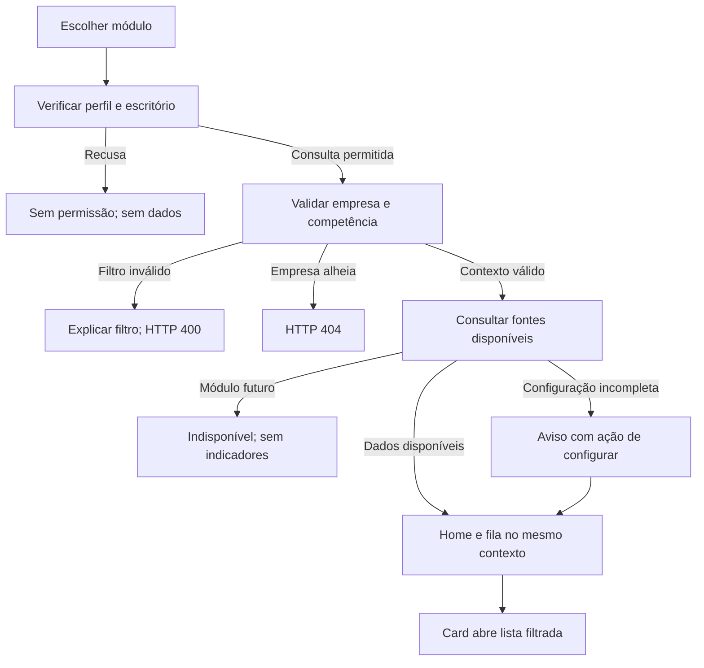

# Página inicial por módulo — contrato operacional

Demanda: [DL-049](../planos/DL-049-home-por-modulo.md). Esta tela mantém o
contexto de empresa e competência ao trocar de domínio e reúne exceções,
empresas que exigem atenção e a próxima ação. Relatórios gerenciais e gráficos
ficam em seus destinos próprios.

Correção de escopo determinada pelo Fred em 30/09/2026:
[DL-051](../planos/DL-051-correcao-dos-modulos.md). Vendas não é módulo do
DataLedger. Estoque e Livro de Registro de Inventário são rotinas de Fiscal
(FIS-39/FIS-47), ainda planejadas, e não possuem home ou item independente
na seleção de módulos. Referência visual não define o escopo do produto.

## Revisão do prompt aplicado

O briefing orienta a interface. Cada exigência abaixo foi traduzida em um
contrato verificável; onde o produto ainda não tem fonte, o limite fica
explícito na tela. Nenhuma pesquisa com operadores foi presumida.

| Trecho do briefing | Ajuste para execução no projeto |
| --- | --- |
| Papel de designer e UX writer | Entregar rotas, copy, estados e componentes na stack existente, com evidência visual. |
| Referência visual de ERP | Aproveitar shell azul e superfícies claras; identidade e navegação permanecem DataLedger. |
| Perda de panorama ao trocar módulo | Persistir empresa/grupo/todas e competência por escritório; revalidar autorização no destino. |
| Identificar prioridade em dez segundos | Medir posição da primeira ação no desktop; a meta de tempo depende do teste com operadores. |
| Contagens da carteira | Mostrar os quatro segmentos juntos, explicar sobreposição e usar “—” quando não acompanhado. |
| Máximo de quatro cards | Até quatro fontes verificáveis; menos cards quando o domínio não fornece as quatro medidas. |
| Vencido antes de bloqueio, hoje e configuração | Usar prazo real quando existir. A fonte atual permite bloqueio e conferência; competência antiga não inventa vencimento. |
| KPI abre lista filtrada | A quantidade e a lista derivam da mesma consulta, preservando escopo, competência e estado. |
| Financeiro como instância do padrão | Aplicar o mesmo shell à página indisponível até existir fonte financeira, sem amostra fictícia em produção. |
| Fiscal com XML, emissão e certificado | Nesta entrega, consultar recepção real de NFS-e; emissão, certificado e obrigação ficam fora do escopo. |
| Contábil e checklist de fechamento | Exibir ocorrências e bloqueios persistidos; a rotina existente continua validando fechamento e reabertura. |
| Folha | Página informativa no padrão comum; implementação do domínio é uma demanda própria. |
| Vendas e Estoque no briefing | Não incluir como módulos. Vendas está fora do escopo; estoque e inventário pertencem a Fiscal, sem anunciar rotinas ainda não implementadas. |
| Fila e empresas críticas | Oito linhas iniciais, cinco empresas críticas e lista completa paginada; sem total de cards tratado como empresas únicas. |
| Ações primárias e “+ Novo” | Oferecer somente destinos reais autorizados; carteira nunca seleciona cliente de escrita silenciosamente. |
| Valores ocultos por permissão | Produzir contagens, sem R$; papel DP e privilégio monetário separado ainda não existem no projeto. |
| Oito estados obrigatórios | Implementar os aplicáveis à fonte; erro bancário e certificado são requisitos futuros, sem simulação de falha real. |
| Competência fechada | Histórico e reabertura condicional, respeitando papel e entrega ao cliente; consulta GET não cria competência. |
| Acessibilidade | Nome do link, status escrito, foco, teclado, região viva, alvos e movimento reduzido medidos no navegador. |
| Copy pt-BR e formatos | Competência abreviada, datas brasileiras e contagens com separador de milhar; singular/plural concordam com o total. |
| Mermaid, wireframes e instâncias | Fluxo documentado e três variantes comparadas; capturas da aplicação substituem o desenho ASCII na validação final. |
| Desktop primeiro | Priorizar 1.440 × 900 e verificar 1.280/390 px; emulação não certifica telefone físico. |
| Biblioteca e animação | Manter templates/CSS e controles nativos; feedback pontual de pressão, sem animação de navegação ou de totais. |
| Hipóteses de negócio | “Não registrada”, “não acompanhado” e “indisponível” são distintos de zero e de competência aberta. |
| Publicação e merge | Commit, PR e quatro checagens aprovadas antes de integrar; merge não autoriza implantação em produção. |

**Prompt revisado para manutenção:** implemente a página inicial do módulo
no shell DataLedger existente. Preserve o contexto autorizado por escritório,
empresa e competência; derive cards e filas das mesmas fontes de leitura.
Use apenas módulos pertencentes ao escopo confirmado do DataLedger; não
importe a estrutura de um ERP comercial da referência visual. Inventário
e controle de estoque pertencem a Fiscal, sem módulo independente.
Mostre primeiro o bloqueio comprovado e a ação de revisão correspondente.
Declare fonte ausente ou estado não acompanhado, sem fabricar número, prazo,
resolução ou operação. Use até quatro cards, carteira com quatro segmentos,
fila limitada e lista completa paginada. Reuse permissões e rotinas do
domínio. Verifique navegação, isolamento, estados, teclado, visual e movimento
reduzido; registre limites reais e evidências no PR antes de integrar.

## Esqueleto e navegação

Shell existente → cabeçalho/filtros → até quatro indicadores → resumo da
carteira → fila de trabalho/atalhos. A fila usa a variante **Compacta**.
Avisos complementares ficam depois dos indicadores, para a configuração
incompleta não preceder visualmente o bloqueio comprovado.
As três alternativas foram renderizadas no Chromium com dados fictícios:

| Direção | Eixo | Resultado da comparação |
| --- | --- | --- |
| Compacta | Ocorrência por linha, ordem global de prioridade | Escolhida: objeto, motivo e CTA ficam juntos e a primeira ação é visível sem expansão. |
| Etapas | Sequência de conferência | Uma etapa pode trazer item menos urgente antes de uma ocorrência crítica de etapa posterior. |
| Carteira | Empresa primeiro, grupos expansíveis | Duplica o papel do resumo da carteira e esconde ocorrências dentro de grupos. |

A escolha foi feita pelo líder por ordem expressa do Fred para execução
autônoma. Isso é comparação de interface, não pesquisa com operadores.
A superfície experimental e seus dados não fazem parte da aplicação.

## Dados e tempos distintos

Contagens têm unidade e destino. Empresa é contada uma vez no segmento;
documento compartilhado é contado uma vez na carteira. Segmentos de empresas
podem se sobrepor. Não somar o total dos cards para obter pendências graves.

| Domínio | Fonte e limite |
| --- | --- |
| Contábil | Competências persistidas e plano de contas. O detector RC-58 identifica lançamentos desbalanceados na base inteira; a origem temporal aparece na fila. Ausência de competência é “Não registrada”, nunca abertura automática. |
| Fiscal | Recepção e consulta de NFS-e. Competência do documento e mês de recepção do arquivo são eixos diferentes. Recusa de arquivo não significa rejeição de emissão. A aplicação não persiste estado de tratamento dessas ocorrências. |
| Livro-caixa | Empresas em modo livro-caixa, plano e movimentação de caixa. Não oferecer Balanço/DRE ou fechamento de partidas dobradas. |
| Financeiro e Folha | Indisponíveis nesta instalação; sem dados fictícios, valores financeiros ou ações anunciadas como prontas. |

Sem prazo cadastrado, informar “Sem prazo informado”. Competência anterior
aberta não comprova vencimento legal. Zero só significa zero apurado;
indisponibilidade, recorte não atribuível ou dado desconhecido usam “—” e
explicação. Histórico de ocorrência não pode ser anunciado como pendência
resolvida apenas porque alguém abriu sua página.

## Contexto, permissão e ações

Uma empresa, seleção de empresas ou todas, sempre dentro do escritório ativo.
Seleção não é consolidação. A competência escolhida, inclusive histórica,
acompanha a troca; preferência inicial é uma empresa elegível. URLs restauram
filtros e a sessão guarda a escolha por escritório.
São conservados os 16 escritórios usados mais recentemente; URLs continuam
restaurando recortes mais antigos. Fiscal sem empresas começa no escopo
“Todas as empresas” e conserva as ocorrências de recepção do escritório sem
atribuir um cliente inexistente.

Somente a view autorizada da home apresenta o seletor de empresas. O contexto
global não expõe listas em páginas que recusam consulta. Os módulos usam suas
funções de permissão existentes; a home produz contagens e não envia R$.
O produto ainda não possui um papel DP nem privilégio separado para valores.

Cada card abre a lista correspondente, com contexto preservado. A ação de
linha abre a rotina existente; fechar, reabrir, receber ou transmitir não
acontece diretamente ao clicar em um indicador. Reabertura depende do papel,
do estado e de a competência não ter sido entregue. Carteira mista mantém
essa decisão por empresa.

## Interação e acessibilidade

Leitura e troca de módulo sem animação. Movimento, quando necessário, serve a
feedback de pressão e usa apenas propriedades pertinentes. Foco visível,
teclado, nome acessível no link do card e anúncio conciso de atualização.
Sem botão dentro de link. Layout desktop primeiro; adaptação estreita mantém
zoom, entradas legíveis, áreas de toque e conteúdo selecionável.

O projeto usa Django/templates e CSS próprio. As bibliotecas React da lista
Pick UI Library não correspondem a esta implementação. Os controles nativos
evitam mudança de stack e nova dependência. A revisão de movimento segue o
formato Before/After/Why. Emulação visual não valida teclado virtual, notch,
hover persistente ou resposta de toque em telefone físico.

### Revisão de interação e movimento

| Before | After | Why e localização |
| --- | --- | --- |
| Avisos empilhados deslocavam a primeira ação para baixo da dobra | Grade de avisos no desktop, após os indicadores; primeira linha inteira até 898,16 px em 1.440 × 900 | Dar acesso imediato ao bloqueio; `static/css/module-home.css`, `.mh-banners`, e `templates/core/module_home.html`. |
| Botões herdavam transição mesmo no teclado | Sem transformação ou transição na interação de teclado | Uso repetido não deve atrasar navegação; CSS, regras `.module-home .botao`. |
| Pressão sem distinção de entrada | Ponteiro: escala 0,97 em 120 ms; liberação em 60 ms, curva `cubic-bezier(0.23, 1, 0.32, 1)` | Feedback curto no botão pressionado, sem mover cards ou páginas; CSS, tokens `--mh-press-duration` e `--mh-release-duration`. |
| Movimento herdado podia contrariar preferência de redução | Transição `0s` e transformação `none`, inclusive durante pressão | Respeitar a preferência; CSS, `prefers-reduced-motion`. |
| Hover legado podia permanecer após toque | Hover por capacidade; neutralização em ponteiro grosso | Evitar aparência de seleção depois de tocar; CSS, `hover: none`/`pointer: coarse`. |
| Anúncio podia sugerir zero apurado em fonte ausente | Mensagem específica de indisponibilidade, recusa ou inaplicabilidade | Região viva deve comunicar a qualidade da apuração; `static/js/module-home.js`, `unavailableStates`. |

**Veredito da revisão de movimento:** aprovado nas condições testadas no
Chromium. Não se propõe animação de entrada, transição de módulo ou contador.
Telefone físico e leitor de tela permanecem não testados.

## Contrato de rotas e indicadores

Home: `/modulos/<modulo>/`. Lista: `/modulos/<modulo>/pendencias/`.
Ambas usam `empresa`, `competencia=2026-09`; seleção de grupo acrescenta
`empresas=1,2`. A lista aceita `estado` e `pagina`, com 25 registros por página;
a home mostra até oito. Os IDs do exemplo são fictícios e precisam pertencer
ao escritório ativo. Filtro inválido responde 400; empresa alheia, 404;
perfil sem consulta, 403, antes de buscar empresas ou totais.

| Módulo | Indicador disponível | Estado da lista ao clicar | Vazio da lista |
| --- | --- | --- | --- |
| Contabilidade | Lotes desbalanceados | `lotes-desbalanceados` | Nenhum registro encontrado com estes filtros. |
| Contabilidade | Competências anteriores abertas | `competencias-anteriores` | Nenhum registro encontrado com estes filtros. |
| Contabilidade | Empresas com competência aberta | `competencias-abertas` | Nenhum registro encontrado com estes filtros. Ausência de competência continua identificada separadamente. |
| Contabilidade | Empresas sem plano de contas | `sem-plano` | Nenhum registro encontrado com estes filtros. |
| Fiscal | Arquivos recusados, somente carteira e perfil autorizado a receber | `arquivos-recusados` | Nenhum registro encontrado com estes filtros. O mês refere-se ao envio. |
| Fiscal | Eventos sem nota no acervo | `eventos-sem-nota` | Nenhum registro encontrado com estes filtros. O mês refere-se à recepção. |
| Fiscal | NFS-e canceladas | `notas-canceladas` | Nenhum registro encontrado com estes filtros. Cancelamento é histórico, não pendência aberta. |
| Livro-caixa | Clientes sem plano de contas | `sem-plano` | Nenhum registro encontrado com estes filtros. |
| Livro-caixa | Clientes sem movimento registrado | `sem-movimento` | Nenhum registro encontrado com estes filtros. Ausência de movimento não comprova atraso. |
| Financeiro | Sem indicador nesta versão | Sem lista apurada | Financeiro ainda não está disponível. |
| Folha | Sem indicador nesta versão | Sem lista apurada | Folha ainda não está disponível. |

Erros bancários e certificado inválido pertencem à especificação para integrações
futuras. Esta entrega não inventa conexão bancária, emissão fiscal, certificado
ou ação de tentar novamente que o produto ainda não possui.

## Componentes e estados

| Componente | Anatomia e estados | Uso obrigatório |
| --- | --- | --- |
| AppShell | Sidebar existente, cabeçalho e conteúdo claro | Manter contexto de escritório; não inserir relatório gerencial na home. |
| ModuleSwitcher | Link de módulo, ativo, disponibilidade e contagem grave quando apurada | Badge de bloqueio só onde há fonte; não somar cards nem exibir zero desconhecido. |
| ModuleHomeHeader / FilterBar | Descrição, seletor com busca, competência pt-BR, Aplicar filtros e seleção de grupo | Uma opção selecionada por vez; o grupo não altera o escopo antes de aplicar. Funciona sem JavaScript. |
| KpiCard | Número, rótulo, status escrito, explicação temporal, CTA | Até quatro; link único com nome acessível, sem botão aninhado. Variantes `ok`, `warning`, `danger`, `muted`; loading no envio do filtro. `error` reservado à fonte que realmente falhou. |
| PortfolioSummary | Cadastradas, ativas, com pendência, configuração incompleta e até cinco empresas críticas | Conjuntos podem se sobrepor. Estado não acompanhado usa “—”, acompanhado de explicação. |
| WorkQueue / WorkQueueItem | Empresa em carteira, objeto, motivo, origem, prazo, status e ação | Prioridade de bloqueio antes de conferência/configuração; sem vencimento inventado. Lista completa paginada conserva filtros. |
| SetupBanner | Título, dependência ausente, texto e ação de configuração | Não afirmar ausência de pendência quando a fonte não está configurada. |
| EmptyState / PermissionState | Título factual, limite da apuração e destinos permitidos | Vazio, sem empresa aplicável, filtro inválido e sem permissão são distintos. |
| ModuleShortcuts | Links autorizados para rotinas existentes | A seleção de carteira não escolhe uma empresa para escrita silenciosamente. |
| Button primary / secondary / ghost | Ação, contraste e foco | Máximo de duas ações de cabeçalho mais “+ Novo”; ações indisponíveis não são anunciadas como funcionais. |
| Toast error / success | Mensagens existentes da rotina de destino | Não emitir sucesso de operação ao consultar card ou abrir lista. |

Competência fechada troca a fila padrão por histórico. “Reabrir” só aparece
para perfil autorizado e competência ainda não entregue; seu destino exige a
revisão existente. A fila de carteira mista mantém o estado de cada empresa.
Atualização por GET anuncia contexto e total conhecido em região viva;
indisponibilidade ou recusa não anunciam uma contagem apurada.

## Fora da primeira entrega

BI da carteira, gráficos decorativos, marketing, onboarding, emissão de NF-e
ou NFS-e, conciliação bancária, processamento de folha, eSocial, transmissão
de obrigações, novos papéis/permissões finas e consolidação de grupo. As
rotinas já existentes continuam nos seus destinos. Telefone físico e teste
com operadores precisam de validação própria; não são inferidos do software.

## Teste com operadores proposto

Cinco operadores, três tarefas: trocar módulo e identificar o item prioritário;
abrir a carteira e chegar à empresa correta; distinguir configuração ou dado
indisponível de zero apurado. Meta proposta: quatro dos cinco identificam
ocorrência e próxima ação em até dez segundos. Registrar tempo, acerto e
conclusão; verificar permissão e competência fechada. Este teste de uso ainda
não foi executado; os testes de software não substituem essa medição.
